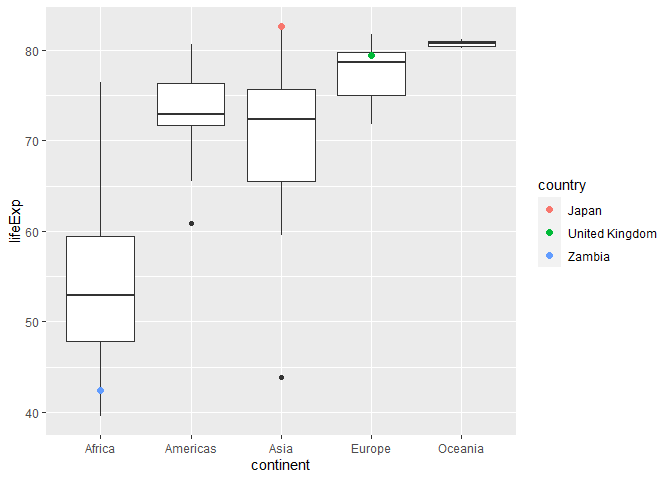

Gapminder
================
Maya Sivanandan
2023

- <a href="#grading-rubric" id="toc-grading-rubric">Grading Rubric</a>
  - <a href="#individual" id="toc-individual">Individual</a>
  - <a href="#due-date" id="toc-due-date">Due Date</a>
- <a href="#guided-eda" id="toc-guided-eda">Guided EDA</a>
  - <a
    href="#q0-perform-your-first-checks-on-the-dataset-what-variables-are-in-this-dataset"
    id="toc-q0-perform-your-first-checks-on-the-dataset-what-variables-are-in-this-dataset"><strong>q0</strong>
    Perform your “first checks” on the dataset. What variables are in this
    dataset?</a>
  - <a
    href="#q1-determine-the-most-and-least-recent-years-in-the-gapminder-dataset"
    id="toc-q1-determine-the-most-and-least-recent-years-in-the-gapminder-dataset"><strong>q1</strong>
    Determine the most and least recent years in the <code>gapminder</code>
    dataset.</a>
  - <a
    href="#q2-filter-on-years-matching-year_min-and-make-a-plot-of-the-gdp-per-capita-against-continent-choose-an-appropriate-geom_-to-visualize-the-data-what-observations-can-you-make"
    id="toc-q2-filter-on-years-matching-year_min-and-make-a-plot-of-the-gdp-per-capita-against-continent-choose-an-appropriate-geom_-to-visualize-the-data-what-observations-can-you-make"><strong>q2</strong>
    Filter on years matching <code>year_min</code>, and make a plot of the
    GDP per capita against continent. Choose an appropriate
    <code>geom_</code> to visualize the data. What observations can you
    make?</a>
  - <a
    href="#q3-you-should-have-found-at-least-three-outliers-in-q2-but-possibly-many-more-identify-those-outliers-figure-out-which-countries-they-are"
    id="toc-q3-you-should-have-found-at-least-three-outliers-in-q2-but-possibly-many-more-identify-those-outliers-figure-out-which-countries-they-are"><strong>q3</strong>
    You should have found <em>at least</em> three outliers in q2 (but
    possibly many more!). Identify those outliers (figure out which
    countries they are).</a>
  - <a
    href="#q4-create-a-plot-similar-to-yours-from-q2-studying-both-year_min-and-year_max-find-a-way-to-highlight-the-outliers-from-q3-on-your-plot-in-a-way-that-lets-you-identify-which-country-is-which-compare-the-patterns-between-year_min-and-year_max"
    id="toc-q4-create-a-plot-similar-to-yours-from-q2-studying-both-year_min-and-year_max-find-a-way-to-highlight-the-outliers-from-q3-on-your-plot-in-a-way-that-lets-you-identify-which-country-is-which-compare-the-patterns-between-year_min-and-year_max"><strong>q4</strong>
    Create a plot similar to yours from q2 studying both
    <code>year_min</code> and <code>year_max</code>. Find a way to highlight
    the outliers from q3 on your plot <em>in a way that lets you identify
    which country is which</em>. Compare the patterns between
    <code>year_min</code> and <code>year_max</code>.</a>
- <a href="#your-own-eda" id="toc-your-own-eda">Your Own EDA</a>
  - <a
    href="#q5-create-at-least-three-new-figures-below-with-each-figure-try-to-pose-new-questions-about-the-data"
    id="toc-q5-create-at-least-three-new-figures-below-with-each-figure-try-to-pose-new-questions-about-the-data"><strong>q5</strong>
    Create <em>at least</em> three new figures below. With each figure, try
    to pose new questions about the data.</a>

*Purpose*: Learning to do EDA well takes practice! In this challenge
you’ll further practice EDA by first completing a guided exploration,
then by conducting your own investigation. This challenge will also give
you a chance to use the wide variety of visual tools we’ve been
learning.

<!-- include-rubric -->

# Grading Rubric

<!-- -------------------------------------------------- -->

Unlike exercises, **challenges will be graded**. The following rubrics
define how you will be graded, both on an individual and team basis.

## Individual

<!-- ------------------------- -->

| Category    | Needs Improvement                                                                                                | Satisfactory                                                                                                               |
|-------------|------------------------------------------------------------------------------------------------------------------|----------------------------------------------------------------------------------------------------------------------------|
| Effort      | Some task **q**’s left unattempted                                                                               | All task **q**’s attempted                                                                                                 |
| Observed    | Did not document observations, or observations incorrect                                                         | Documented correct observations based on analysis                                                                          |
| Supported   | Some observations not clearly supported by analysis                                                              | All observations clearly supported by analysis (table, graph, etc.)                                                        |
| Assessed    | Observations include claims not supported by the data, or reflect a level of certainty not warranted by the data | Observations are appropriately qualified by the quality & relevance of the data and (in)conclusiveness of the support      |
| Specified   | Uses the phrase “more data are necessary” without clarification                                                  | Any statement that “more data are necessary” specifies which *specific* data are needed to answer what *specific* question |
| Code Styled | Violations of the [style guide](https://style.tidyverse.org/) hinder readability                                 | Code sufficiently close to the [style guide](https://style.tidyverse.org/)                                                 |

## Due Date

<!-- ------------------------- -->

All the deliverables stated in the rubrics above are due **at midnight**
before the day of the class discussion of the challenge. See the
[Syllabus](https://docs.google.com/document/d/1qeP6DUS8Djq_A0HMllMqsSqX3a9dbcx1/edit?usp=sharing&ouid=110386251748498665069&rtpof=true&sd=true)
for more information.

``` r
library(tidyverse)
```

    ## ── Attaching packages ─────────────────────────────────────── tidyverse 1.3.2 ──
    ## ✔ ggplot2 3.4.0      ✔ purrr   1.0.1 
    ## ✔ tibble  3.1.8      ✔ dplyr   1.0.10
    ## ✔ tidyr   1.2.1      ✔ stringr 1.5.0 
    ## ✔ readr   2.1.3      ✔ forcats 0.5.2 
    ## ── Conflicts ────────────────────────────────────────── tidyverse_conflicts() ──
    ## ✖ dplyr::filter() masks stats::filter()
    ## ✖ dplyr::lag()    masks stats::lag()

``` r
library(gapminder)
```

*Background*: [Gapminder](https://www.gapminder.org/about-gapminder/) is
an independent organization that seeks to educate people about the state
of the world. They seek to counteract the worldview constructed by a
hype-driven media cycle, and promote a “fact-based worldview” by
focusing on data. The dataset we’ll study in this challenge is from
Gapminder.

# Guided EDA

<!-- -------------------------------------------------- -->

First, we’ll go through a round of *guided EDA*. Try to pay attention to
the high-level process we’re going through—after this guided round
you’ll be responsible for doing another cycle of EDA on your own!

### **q0** Perform your “first checks” on the dataset. What variables are in this dataset?

``` r
gapminder %>% head()
```

    ## # A tibble: 6 × 6
    ##   country     continent  year lifeExp      pop gdpPercap
    ##   <fct>       <fct>     <int>   <dbl>    <int>     <dbl>
    ## 1 Afghanistan Asia       1952    28.8  8425333      779.
    ## 2 Afghanistan Asia       1957    30.3  9240934      821.
    ## 3 Afghanistan Asia       1962    32.0 10267083      853.
    ## 4 Afghanistan Asia       1967    34.0 11537966      836.
    ## 5 Afghanistan Asia       1972    36.1 13079460      740.
    ## 6 Afghanistan Asia       1977    38.4 14880372      786.

``` r
gapminder %>% glimpse()
```

    ## Rows: 1,704
    ## Columns: 6
    ## $ country   <fct> "Afghanistan", "Afghanistan", "Afghanistan", "Afghanistan", …
    ## $ continent <fct> Asia, Asia, Asia, Asia, Asia, Asia, Asia, Asia, Asia, Asia, …
    ## $ year      <int> 1952, 1957, 1962, 1967, 1972, 1977, 1982, 1987, 1992, 1997, …
    ## $ lifeExp   <dbl> 28.801, 30.332, 31.997, 34.020, 36.088, 38.438, 39.854, 40.8…
    ## $ pop       <int> 8425333, 9240934, 10267083, 11537966, 13079460, 14880372, 12…
    ## $ gdpPercap <dbl> 779.4453, 820.8530, 853.1007, 836.1971, 739.9811, 786.1134, …

``` r
gapminder %>% summary()
```

    ##         country        continent        year         lifeExp     
    ##  Afghanistan:  12   Africa  :624   Min.   :1952   Min.   :23.60  
    ##  Albania    :  12   Americas:300   1st Qu.:1966   1st Qu.:48.20  
    ##  Algeria    :  12   Asia    :396   Median :1980   Median :60.71  
    ##  Angola     :  12   Europe  :360   Mean   :1980   Mean   :59.47  
    ##  Argentina  :  12   Oceania : 24   3rd Qu.:1993   3rd Qu.:70.85  
    ##  Australia  :  12                  Max.   :2007   Max.   :82.60  
    ##  (Other)    :1632                                                
    ##       pop              gdpPercap       
    ##  Min.   :6.001e+04   Min.   :   241.2  
    ##  1st Qu.:2.794e+06   1st Qu.:  1202.1  
    ##  Median :7.024e+06   Median :  3531.8  
    ##  Mean   :2.960e+07   Mean   :  7215.3  
    ##  3rd Qu.:1.959e+07   3rd Qu.:  9325.5  
    ##  Max.   :1.319e+09   Max.   :113523.1  
    ## 

**Observations**:

- country, continent, year, lifeExp, pop, gdpPercap

### **q1** Determine the most and least recent years in the `gapminder` dataset.

*Hint*: Use the `pull()` function to get a vector out of a tibble.
(Rather than the `$` notation of base R.)

``` r
## TASK: Find the largest and smallest values of `year` in `gapminder`
year_max <- 
  gapminder %>% 
    pull(year) %>% 
      max()

year_min <-
  gapminder %>% 
    pull(year) %>% 
      min()
```

Use the following test to check your work.

``` r
## NOTE: No need to change this
assertthat::assert_that(year_max %% 7 == 5)
```

    ## [1] TRUE

``` r
assertthat::assert_that(year_max %% 3 == 0)
```

    ## [1] TRUE

``` r
assertthat::assert_that(year_min %% 7 == 6)
```

    ## [1] TRUE

``` r
assertthat::assert_that(year_min %% 3 == 2)
```

    ## [1] TRUE

``` r
if (is_tibble(year_max)) {
  print("year_max is a tibble; try using `pull()` to get a vector")
  assertthat::assert_that(False)
}

print("Nice!")
```

    ## [1] "Nice!"

### **q2** Filter on years matching `year_min`, and make a plot of the GDP per capita against continent. Choose an appropriate `geom_` to visualize the data. What observations can you make?

You may encounter difficulties in visualizing these data; if so document
your challenges and attempt to produce the most informative visual you
can.

``` r
## TASK: Create a visual of gdpPercap vs continent
df_q2 <- 
  gapminder[gapminder$year == year_min, ]


# df_q2 %>% 
#   ggplot() +
#   aes(continent, gdpPercap)+
#   geom_boxplot()
# 
# 
# df_q2_mod <- df_q2[df_q2$gdpPercap < 90000, ]
# 
# df_q2_mod %>%
#   ggplot() +
#   aes(continent, gdpPercap)+
#   geom_boxplot()


# df_q2 %>% 
#   ggplot() +
#   aes(continent, gdpPercap)+
#   geom_boxplot() +
#   ylim(0, 15000)


df_q2 %>%
  ggplot() +
  aes(continent, gdpPercap)+
  geom_boxplot() +
  scale_y_continuous(trans='log10')
```

<!-- -->

``` r
## Check the mean gdpPerCap of Asia with and without Kuwait
# df_q2[df_q2$continent == "Asia", ] %>% 
# summarize(mean(gdpPercap))
# 
# df_q2_mod[df_q2_mod$continent == "Asia", ] %>% 
# summarize(mean(gdpPercap))
```

**Observations**:

- Oceania seems to have the highest `gdpPercap` and the least variation
  - This is likely because in this dataset, the continent of Oceania
    only has two countries, Australia and New Zealand.
- Europe has the next highest `gdpPerCap`, but it also has the most
  variation (shown by the lower quartile being at around 3000 and the
  upper quartile at around 7500) despite not having as having fewer
  countries than both Asia and Africa (30 vs 33 and 52, respectively)

**Difficulties & Approaches**:

- In this dataset, many of the values of `gdpPercap` are similar enough
  to overlap on the graphy, but they are not the exact same values, so
  `geom_point()` and `geom_count()` do not best represent the data. I
  instead chose to use a box plot to show the general trends of the data
  (mean value as well as the interquartile range)
- When looking at only data from 1952, the `gdpPercap` of Kuwait is over
  7 times greater than the next highest GDP (about 108,000 compared to
  15,000). This causes all but one of the data points to be represented
  in the lower 1/8th of the graph (vertically), meaning the points
  overlap visually and it is hard to make observations.
  - To solve this, I considered changing the limit of the y-axis, such
    that the data point is not shown visually but is still used to
    calculate the box plot. Sadly, I don’t think it worked as it gives
    the warning *“Warning: \[38;5;252mRemoved 1 rows containing
    non-finite values (`stat_boxplot()`).\[39m”* and the plot looks
    identical to one I generated where I removed the datapoint before
    plotting. This does drastically change the boxplot for Asia since
    the mean `gdpPercap` goes from 5195.484 with Kuwait to 1970.894
    without.
  - I then tried transforming the y-axis to a logarithmic scale, which
    does show all the data points more evenly spread across the
    y-axis.Howvever, it becomes harder to visually understand the box
    plots, since each tick on the y-axis of the graph is a drastically
    different amount.

### **q3** You should have found *at least* three outliers in q2 (but possibly many more!). Identify those outliers (figure out which countries they are).

``` r
## TASK: Identify the outliers from q2
df_q2 %>% 
  ggplot() +
  aes(y = gdpPercap)+
  geom_boxplot() +
  ylim(0, 15000)
```

    ## Warning: Removed 1 rows containing non-finite values (`stat_boxplot()`).

<!-- -->

``` r
df_q2_upper = 3913.5 + (IQR(df_q2$gdpPercap)*1.5)
## No lower outliers


df_q3_o1 <- df_q2[df_q2$gdpPercap > df_q2_upper, ]
df_q3_o1
```

    ## # A tibble: 12 × 6
    ##    country        continent  year lifeExp       pop gdpPercap
    ##    <fct>          <fct>     <int>   <dbl>     <int>     <dbl>
    ##  1 Australia      Oceania    1952    69.1   8691212    10040.
    ##  2 Bahrain        Asia       1952    50.9    120447     9867.
    ##  3 Canada         Americas   1952    68.8  14785584    11367.
    ##  4 Denmark        Europe     1952    70.8   4334000     9692.
    ##  5 Kuwait         Asia       1952    55.6    160000   108382.
    ##  6 Netherlands    Europe     1952    72.1  10381988     8942.
    ##  7 New Zealand    Oceania    1952    69.4   1994794    10557.
    ##  8 Norway         Europe     1952    72.7   3327728    10095.
    ##  9 Sweden         Europe     1952    71.9   7124673     8528.
    ## 10 Switzerland    Europe     1952    69.6   4815000    14734.
    ## 11 United Kingdom Europe     1952    69.2  50430000     9980.
    ## 12 United States  Americas   1952    68.4 157553000    13990.

``` r
# df_q2_asia <- df_q2[df_q2$continent == "Asia", ]
# df_q2_upper_asia = 3035.3 + (IQR(df_q2_asia$gdpPercap)*1.5)
# 
# df_q2_americas <- df_q2[df_q2$continent == "Americas", ]
# df_q2_upper_americas = 3940 + (IQR(df_q2_asia$gdpPercap)*1.5)
# 
# df_q2_africa <- df_q2[df_q2$continent == "Africa", ]
# df_q2_upper_africa = 1454.9 + (IQR(df_q2_asia$gdpPercap)*1.5)
# 
# df_q2_europe <- df_q2[df_q2$continent == "Europe", ]
# df_q2_upper_africa = 7236.8 + (IQR(df_q2_asia$gdpPercap)*1.5)
# 
# df_q2_africa%>% 
#   summary()
# 
# 
# df_q3_o2 <- full_join(df_q2_asia[df_q2_asia$gdpPercap > df_q2_upper_asia, ], 
#                       df_q2_africa[df_q2_africa$gdpPercap > df_q2_upper_africa, ])
```

**Observations**:

- Identify the outlier countries from q2
  - According to `geom_boxplot()`, outlying values are those which are
    more than (1.5 \* IQR) below the lower quartile or more than (1.5 \*
    IQR) above the upper quartile. This means that when looking at
    df_q2, the following countries are outliers: Australia, Bahrain,
    Canada, Denmark, Kuwait, Netherlands, New Zealand, Norway, Sweden,
    Switzerland, United Kingdom, United States.
  - This differs from looking at outliers with regard to continent. For
    example, Australia and New Zealand wouldn’t be considered outliers
    for Oceania

*Hint*: For the next task, it’s helpful to know a ggplot trick we’ll
learn in an upcoming exercise: You can use the `data` argument inside
any `geom_*` to modify the data that will be plotted *by that geom
only*. For instance, you can use this trick to filter a set of points to
label:

``` r
## NOTE: No need to edit, use ideas from this in q4 below
gapminder %>%
  filter(year == max(year)) %>%

  ggplot(aes(continent, lifeExp)) +
  geom_boxplot() +
  geom_point(
    data = . %>% filter(country %in% c("United Kingdom", "Japan", "Zambia")),
    mapping = aes(color = country),
    size = 2
  )
```

<!-- -->

### **q4** Create a plot similar to yours from q2 studying both `year_min` and `year_max`. Find a way to highlight the outliers from q3 on your plot *in a way that lets you identify which country is which*. Compare the patterns between `year_min` and `year_max`.

*Hint*: We’ve learned a lot of different ways to show multiple
variables; think about using different aesthetics or facets.

``` r
## TASK: Create a visual of gdpPercap vs continent

gapminder %>%
  filter(year == max(year) |  year == min(year)) %>%

  ggplot(aes(continent, gdpPercap)) +
  geom_boxplot()+
  facet_wrap(~year) +
  scale_y_continuous(trans='log10') +
  geom_point(
  data = . %>% 
      group_by(year) %>%
      filter(
          gdpPercap < quantile(gdpPercap, 0.25)- IQR(gdpPercap*1.5) | 
          gdpPercap > quantile(gdpPercap, 0.75)+ IQR(gdpPercap*1.5)
      ),
      mapping = aes(color = country),
      size = 2
)
```

<!-- -->

**Observations**:

- Overall, `gdpPercap` increased between 1952 and 2007 for all
  continents.
- The United States was an outlier in 1952 and 2007
- The upper quartile for Europe and Americas grew significantly between
  1952 and 2007
- The range between New Zealand and Australia grew slightly between 1952
  and 2007 (the boxplot for Oceania is not just a line)

# Your Own EDA

<!-- -------------------------------------------------- -->

Now it’s your turn! We just went through guided EDA considering the GDP
per capita at two time points. You can continue looking at outliers,
consider different years, repeat the exercise with `lifeExp`, consider
the relationship between variables, or something else entirely.

### **q5** Create *at least* three new figures below. With each figure, try to pose new questions about the data.

``` r
gapminder %>%
  filter(year == max(year) |  year == min(year)) %>%

  ggplot(aes(lifeExp, pop)) +
  scale_y_continuous(trans='log10') +
  geom_point(mapping = aes(color = continent), size = 2)+
  facet_wrap(~year) +
  facet_grid(vars(continent), vars(year))
```

<!-- -->

- The life expectancy for all continents has increased between 1952 and
  2007
- The life expectancy for Europe and Americas seems to have become more
  concentrated between 1952 and 2007, there is less variation between
  the different countries
- The life expectancy for countries in Africa has increased overall, but
  there is also more variation between the countries.
- There is one country in Asia from 2007 that seems to have an outlying
  life expectancy (\~44 years)

``` r
gapminder %>%
  filter(year == max(year) |  year == min(year)) %>%

  ggplot(aes(lifeExp, gdpPercap)) +
  scale_y_continuous(trans='log10') +
  geom_point(mapping = aes(color = continent), size = 2)+
  facet_wrap(~year) +
  facet_grid(vars(continent), vars(year))
```

<!-- -->

- Overall, there seems to be a general trend where countries with a
  higher GDP per capita also have a higher life expectancy
- Between 1952 and 2007, the life expectancy and GDP per capita for the
  countries in Asia, Americas, and Europe all showed a significant
  increase
- Europe 2007 seems to show the least variation of life expectancy/GDP
  between countries (the country points are more clumped together)

``` r
gapminder %>%
  filter(year == max(year) |  year == min(year)) %>%
  ggplot(aes(gdpPercap, pop)) +
  scale_y_continuous(trans='log10') +
  scale_x_continuous(trans='log10') +
  geom_point(mapping = aes(color = continent), size = 2)+
  facet_wrap(~year) +
  facet_grid(vars(continent), vars(year))
```

<!-- -->

- Population doesn’t seem to vary significantly between 1952 and 2007
- There doesn’t seem to be a clear relationship between population and
  GDP per capita
  - Asia in 1952 shows a slight trend where lower populations had higher
    GDP per capita
