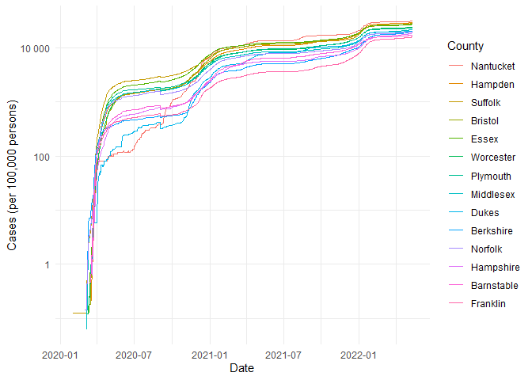

COVID-19
================
Maya Sivanandan
2023

- <a href="#grading-rubric" id="toc-grading-rubric">Grading Rubric</a>
  - <a href="#individual" id="toc-individual">Individual</a>
  - <a href="#due-date" id="toc-due-date">Due Date</a>
- <a href="#the-big-picture" id="toc-the-big-picture">The Big Picture</a>
- <a href="#get-the-data" id="toc-get-the-data">Get the Data</a>
  - <a href="#navigating-the-census-bureau"
    id="toc-navigating-the-census-bureau">Navigating the Census Bureau</a>
    - <a
      href="#q1-load-table-b01003-into-the-following-tibble-make-sure-the-column-names-are-id-geographic-area-name-estimatetotal-margin-of-errortotal"
      id="toc-q1-load-table-b01003-into-the-following-tibble-make-sure-the-column-names-are-id-geographic-area-name-estimatetotal-margin-of-errortotal"><strong>q1</strong>
      Load Table <code>B01003</code> into the following tibble. Make sure the
      column names are
      <code>id, Geographic Area Name, Estimate!!Total, Margin of Error!!Total</code>.</a>
  - <a href="#automated-download-of-nyt-data"
    id="toc-automated-download-of-nyt-data">Automated Download of NYT
    Data</a>
    - <a
      href="#q2-visit-the-nyt-github-repo-and-find-the-url-for-the-raw-us-county-level-data-assign-that-url-as-a-string-to-the-variable-below"
      id="toc-q2-visit-the-nyt-github-repo-and-find-the-url-for-the-raw-us-county-level-data-assign-that-url-as-a-string-to-the-variable-below"><strong>q2</strong>
      Visit the NYT GitHub repo and find the URL for the <strong>raw</strong>
      US County-level data. Assign that URL as a string to the variable
      below.</a>
- <a href="#join-the-data" id="toc-join-the-data">Join the Data</a>
  - <a href="#q3-process-the-id-column-of-df_pop-to-create-a-fips-column"
    id="toc-q3-process-the-id-column-of-df_pop-to-create-a-fips-column"><strong>q3</strong>
    Process the <code>id</code> column of <code>df_pop</code> to create a
    <code>fips</code> column.</a>
  - <a
    href="#q4-join-df_covid-with-df_q3-by-the-fips-column-use-the-proper-type-of-join-to-preserve-only-the-rows-in-df_covid"
    id="toc-q4-join-df_covid-with-df_q3-by-the-fips-column-use-the-proper-type-of-join-to-preserve-only-the-rows-in-df_covid"><strong>q4</strong>
    Join <code>df_covid</code> with <code>df_q3</code> by the
    <code>fips</code> column. Use the proper type of join to preserve
    <em>only</em> the rows in <code>df_covid</code>.</a>
- <a href="#analyze" id="toc-analyze">Analyze</a>
  - <a href="#normalize" id="toc-normalize">Normalize</a>
    - <a
      href="#q5-use-the-population-estimates-in-df_data-to-normalize-cases-and-deaths-to-produce-per-100000-counts-3-store-these-values-in-the-columns-cases_per100k-and-deaths_per100k"
      id="toc-q5-use-the-population-estimates-in-df_data-to-normalize-cases-and-deaths-to-produce-per-100000-counts-3-store-these-values-in-the-columns-cases_per100k-and-deaths_per100k"><strong>q5</strong>
      Use the <code>population</code> estimates in <code>df_data</code> to
      normalize <code>cases</code> and <code>deaths</code> to produce per
      100,000 counts [3]. Store these values in the columns
      <code>cases_per100k</code> and <code>deaths_per100k</code>.</a>
  - <a href="#guided-eda" id="toc-guided-eda">Guided EDA</a>
    - <a
      href="#q6-compute-the-mean-and-standard-deviation-for-cases_per100k-and-deaths_per100k"
      id="toc-q6-compute-the-mean-and-standard-deviation-for-cases_per100k-and-deaths_per100k"><strong>q6</strong>
      Compute the mean and standard deviation for <code>cases_per100k</code>
      and <code>deaths_per100k</code>.</a>
    - <a
      href="#q7-find-the-top-10-counties-in-terms-of-cases_per100k-and-the-top-10-in-terms-of-deaths_per100k-report-the-population-of-each-county-along-with-the-per-100000-counts-compare-the-counts-against-the-mean-values-you-found-in-q6-note-any-observations"
      id="toc-q7-find-the-top-10-counties-in-terms-of-cases_per100k-and-the-top-10-in-terms-of-deaths_per100k-report-the-population-of-each-county-along-with-the-per-100000-counts-compare-the-counts-against-the-mean-values-you-found-in-q6-note-any-observations"><strong>q7</strong>
      Find the top 10 counties in terms of <code>cases_per100k</code>, and the
      top 10 in terms of <code>deaths_per100k</code>. Report the population of
      each county along with the per-100,000 counts. Compare the counts
      against the mean values you found in q6. Note any observations.</a>
  - <a href="#self-directed-eda" id="toc-self-directed-eda">Self-directed
    EDA</a>
    - <a
      href="#q8-drive-your-own-ship-youve-just-put-together-a-very-rich-dataset-you-now-get-to-explore-pick-your-own-direction-and-generate-at-least-one-punchline-figure-to-document-an-interesting-finding-i-give-a-couple-tips--ideas-below"
      id="toc-q8-drive-your-own-ship-youve-just-put-together-a-very-rich-dataset-you-now-get-to-explore-pick-your-own-direction-and-generate-at-least-one-punchline-figure-to-document-an-interesting-finding-i-give-a-couple-tips--ideas-below"><strong>q8</strong>
      Drive your own ship: You’ve just put together a very rich dataset; you
      now get to explore! Pick your own direction and generate at least one
      punchline figure to document an interesting finding. I give a couple
      tips &amp; ideas below:</a>
    - <a href="#ideas" id="toc-ideas">Ideas</a>
    - <a href="#aside-some-visualization-tricks"
      id="toc-aside-some-visualization-tricks">Aside: Some visualization
      tricks</a>
    - <a href="#geographic-exceptions"
      id="toc-geographic-exceptions">Geographic exceptions</a>
- <a href="#notes" id="toc-notes">Notes</a>

*Purpose*: In this challenge, you’ll learn how to navigate the U.S.
Census Bureau website, programmatically download data from the internet,
and perform a county-level population-weighted analysis of current
COVID-19 trends. This will give you the base for a very deep
investigation of COVID-19, which we’ll build upon for Project 1.

<!-- include-rubric -->

# Grading Rubric

<!-- -------------------------------------------------- -->

Unlike exercises, **challenges will be graded**. The following rubrics
define how you will be graded, both on an individual and team basis.

## Individual

<!-- ------------------------- -->

| Category    | Needs Improvement                                                                                                | Satisfactory                                                                                                               |
|-------------|------------------------------------------------------------------------------------------------------------------|----------------------------------------------------------------------------------------------------------------------------|
| Effort      | Some task **q**’s left unattempted                                                                               | All task **q**’s attempted                                                                                                 |
| Observed    | Did not document observations, or observations incorrect                                                         | Documented correct observations based on analysis                                                                          |
| Supported   | Some observations not clearly supported by analysis                                                              | All observations clearly supported by analysis (table, graph, etc.)                                                        |
| Assessed    | Observations include claims not supported by the data, or reflect a level of certainty not warranted by the data | Observations are appropriately qualified by the quality & relevance of the data and (in)conclusiveness of the support      |
| Specified   | Uses the phrase “more data are necessary” without clarification                                                  | Any statement that “more data are necessary” specifies which *specific* data are needed to answer what *specific* question |
| Code Styled | Violations of the [style guide](https://style.tidyverse.org/) hinder readability                                 | Code sufficiently close to the [style guide](https://style.tidyverse.org/)                                                 |

## Due Date

<!-- ------------------------- -->

All the deliverables stated in the rubrics above are due **at midnight**
before the day of the class discussion of the challenge. See the
[Syllabus](https://docs.google.com/document/d/1qeP6DUS8Djq_A0HMllMqsSqX3a9dbcx1/edit?usp=sharing&ouid=110386251748498665069&rtpof=true&sd=true)
for more information.

``` r
library(tidyverse)
```

    ## Warning: package 'tidyverse' was built under R version 4.2.3

    ## Warning: package 'ggplot2' was built under R version 4.2.3

    ## Warning: package 'tibble' was built under R version 4.2.3

    ## Warning: package 'tidyr' was built under R version 4.2.3

    ## Warning: package 'readr' was built under R version 4.2.3

    ## Warning: package 'dplyr' was built under R version 4.2.3

    ## Warning: package 'forcats' was built under R version 4.2.3

    ## Warning: package 'lubridate' was built under R version 4.2.3

    ## ── Attaching core tidyverse packages ──────────────────────── tidyverse 2.0.0 ──
    ## ✔ dplyr     1.1.1     ✔ readr     2.1.4
    ## ✔ forcats   1.0.0     ✔ stringr   1.5.0
    ## ✔ ggplot2   3.4.2     ✔ tibble    3.2.1
    ## ✔ lubridate 1.9.2     ✔ tidyr     1.3.0
    ## ✔ purrr     1.0.1     
    ## ── Conflicts ────────────────────────────────────────── tidyverse_conflicts() ──
    ## ✖ dplyr::filter() masks stats::filter()
    ## ✖ dplyr::lag()    masks stats::lag()
    ## ℹ Use the ]8;;http://conflicted.r-lib.org/conflicted package]8;; to force all conflicts to become errors

*Background*:
[COVID-19](https://en.wikipedia.org/wiki/Coronavirus_disease_2019) is
the disease caused by the virus SARS-CoV-2. In 2020 it became a global
pandemic, leading to huge loss of life and tremendous disruption to
society. The New York Times (as of writing) publishes up-to-date data on
the progression of the pandemic across the United States—we will study
these data in this challenge.

*Optional Readings*: I’ve found this [ProPublica
piece](https://www.propublica.org/article/how-to-understand-covid-19-numbers)
on “How to understand COVID-19 numbers” to be very informative!

# The Big Picture

<!-- -------------------------------------------------- -->

We’re about to go through *a lot* of weird steps, so let’s first fix the
big picture firmly in mind:

We want to study COVID-19 in terms of data: both case counts (number of
infections) and deaths. We’re going to do a county-level analysis in
order to get a high-resolution view of the pandemic. Since US counties
can vary widely in terms of their population, we’ll need population
estimates in order to compute infection rates (think back to the
`Titanic` challenge).

That’s the high-level view; now let’s dig into the details.

# Get the Data

<!-- -------------------------------------------------- -->

1.  County-level population estimates (Census Bureau)
2.  County-level COVID-19 counts (New York Times)

## Navigating the Census Bureau

<!-- ------------------------- -->

**Steps**: Our objective is to find the 2018 American Community
Survey\[1\] (ACS) Total Population estimates, disaggregated by counties.
To check your results, this is Table `B01003`.

1.  Go to [data.census.gov](data.census.gov).
2.  Scroll down and click `View Tables`.
3.  Apply filters to find the ACS **Total Population** estimates,
    disaggregated by counties. I used the filters:

- `Topics > Populations and People > Counts, Estimates, and Projections > Population Total`
- `Geography > County > All counties in United States`

5.  Select the **Total Population** table and click the `Download`
    button to download the data; make sure to select the 2018 5-year
    estimates.
6.  Unzip and move the data to your `challenges/data` folder.

- Note that the data will have a crazy-long filename like
  `ACSDT5Y2018.B01003_data_with_overlays_2020-07-26T094857.csv`. That’s
  because metadata is stored in the filename, such as the year of the
  estimate (`Y2018`) and my access date (`2020-07-26`). **Your filename
  will vary based on when you download the data**, so make sure to copy
  the filename that corresponds to what you downloaded!

### **q1** Load Table `B01003` into the following tibble. Make sure the column names are `id, Geographic Area Name, Estimate!!Total, Margin of Error!!Total`.

*Hint*: You will need to use the `skip` keyword when loading these data!

``` r
## TASK: Load the census bureau data with the following tibble name.
filename <- "./data/ACSDT5Y2018.B01003-Data.csv"
col_names_ACS <-
  c("id",
    "Geographic Area Name",
    "Estimate!!Total",
    "Estimate!!Total-Annotate",
    "Margin of Error!!Total",
    "Margin of Error!!Total_Annotate"
  )

col_types_ACS = c(
    "Estimate!!Total" = "numeric",
    "Estimate!!Total-Annotate" = "numeric",
    "Margin of Error!!Total" = "numeric",
    "Margin of Error!!Total_Annotate" = "numeric")

df_pop <- read_csv(filename,
                   skip = 2,
                   col_names = col_names_ACS, 
                   col_types = col_types_ACS)
```

    ## Warning: One or more parsing issues, call `problems()` on your data frame for details,
    ## e.g.:
    ##   dat <- vroom(...)
    ##   problems(dat)

``` r
df_pop_narrow <-
  df_pop %>%
  select(-c("Estimate!!Total-Annotate","Margin of Error!!Total_Annotate")) %>% 
  mutate(
    "Margin of Error!!Total" = replace_na(0)
    )

head(df_pop_narrow, 50)
```

    ## # A tibble: 50 × 4
    ##    id            `Geographic Area Name` `Estimate!!Total` Margin of Error!!Tot…¹
    ##    <chr>         <chr>                              <dbl>                  <dbl>
    ##  1 0500000US010… Autauga County, Alaba…             55200                      0
    ##  2 0500000US010… Baldwin County, Alaba…            208107                      0
    ##  3 0500000US010… Barbour County, Alaba…             25782                      0
    ##  4 0500000US010… Bibb County, Alabama               22527                      0
    ##  5 0500000US010… Blount County, Alabama             57645                      0
    ##  6 0500000US010… Bullock County, Alaba…             10352                      0
    ##  7 0500000US010… Butler County, Alabama             20025                      0
    ##  8 0500000US010… Calhoun County, Alaba…            115098                      0
    ##  9 0500000US010… Chambers County, Alab…             33826                      0
    ## 10 0500000US010… Cherokee County, Alab…             25853                      0
    ## # ℹ 40 more rows
    ## # ℹ abbreviated name: ¹​`Margin of Error!!Total`

*Note*: You can find information on 1-year, 3-year, and 5-year estimates
[here](https://www.census.gov/programs-surveys/acs/guidance/estimates.html).
The punchline is that 5-year estimates are more reliable but less
current.

## Automated Download of NYT Data

<!-- ------------------------- -->

ACS 5-year estimates don’t change all that often, but the COVID-19 data
are changing rapidly. To that end, it would be nice to be able to
*programmatically* download the most recent data for analysis; that way
we can update our analysis whenever we want simply by re-running our
notebook. This next problem will have you set up such a pipeline.

The New York Times is publishing up-to-date data on COVID-19 on
[GitHub](https://github.com/nytimes/covid-19-data).

### **q2** Visit the NYT [GitHub](https://github.com/nytimes/covid-19-data) repo and find the URL for the **raw** US County-level data. Assign that URL as a string to the variable below.

``` r
## TASK: Find the URL for the NYT covid-19 county-level data
url_counties <- 
  "https://raw.githubusercontent.com/nytimes/covid-19-data/master/us-counties.csv"
```

Once you have the url, the following code will download a local copy of
the data, then load the data into R.

``` r
## NOTE: No need to change this; just execute
## Set the filename of the data to download
filename_nyt <- "./data/nyt_counties.csv"

## Download the data locally
curl::curl_download(
        url_counties,
        destfile = filename_nyt
      )

## Loads the downloaded csv
df_covid <- read_csv(filename_nyt)
```

    ## Rows: 2502832 Columns: 6
    ## ── Column specification ────────────────────────────────────────────────────────
    ## Delimiter: ","
    ## chr  (3): county, state, fips
    ## dbl  (2): cases, deaths
    ## date (1): date
    ## 
    ## ℹ Use `spec()` to retrieve the full column specification for this data.
    ## ℹ Specify the column types or set `show_col_types = FALSE` to quiet this message.

``` r
head(df_covid)
```

    ## # A tibble: 6 × 6
    ##   date       county    state      fips  cases deaths
    ##   <date>     <chr>     <chr>      <chr> <dbl>  <dbl>
    ## 1 2020-01-21 Snohomish Washington 53061     1      0
    ## 2 2020-01-22 Snohomish Washington 53061     1      0
    ## 3 2020-01-23 Snohomish Washington 53061     1      0
    ## 4 2020-01-24 Cook      Illinois   17031     1      0
    ## 5 2020-01-24 Snohomish Washington 53061     1      0
    ## 6 2020-01-25 Orange    California 06059     1      0

You can now re-run the chunk above (or the entire notebook) to pull the
most recent version of the data. Thus you can periodically re-run this
notebook to check in on the pandemic as it evolves.

*Note*: You should feel free to copy-paste the code above for your own
future projects!

# Join the Data

<!-- -------------------------------------------------- -->

To get a sense of our task, let’s take a glimpse at our two data
sources.

``` r
## NOTE: No need to change this; just execute
df_pop %>% glimpse
```

    ## Rows: 3,220
    ## Columns: 6
    ## $ id                                <chr> "0500000US01001", "0500000US01003", …
    ## $ `Geographic Area Name`            <chr> "Autauga County, Alabama", "Baldwin …
    ## $ `Estimate!!Total`                 <dbl> 55200, 208107, 25782, 22527, 57645, …
    ## $ `Estimate!!Total-Annotate`        <dbl> NA, NA, NA, NA, NA, NA, NA, NA, NA, …
    ## $ `Margin of Error!!Total`          <dbl> NA, NA, NA, NA, NA, NA, NA, NA, NA, …
    ## $ `Margin of Error!!Total_Annotate` <dbl> NA, NA, NA, NA, NA, NA, NA, NA, NA, …

``` r
df_covid %>% glimpse
```

    ## Rows: 2,502,832
    ## Columns: 6
    ## $ date   <date> 2020-01-21, 2020-01-22, 2020-01-23, 2020-01-24, 2020-01-24, 20…
    ## $ county <chr> "Snohomish", "Snohomish", "Snohomish", "Cook", "Snohomish", "Or…
    ## $ state  <chr> "Washington", "Washington", "Washington", "Illinois", "Washingt…
    ## $ fips   <chr> "53061", "53061", "53061", "17031", "53061", "06059", "17031", …
    ## $ cases  <dbl> 1, 1, 1, 1, 1, 1, 1, 1, 1, 1, 1, 1, 1, 1, 1, 1, 1, 1, 1, 1, 1, …
    ## $ deaths <dbl> 0, 0, 0, 0, 0, 0, 0, 0, 0, 0, 0, 0, 0, 0, 0, 0, 0, 0, 0, 0, 0, …

To join these datasets, we’ll need to use [FIPS county
codes](https://en.wikipedia.org/wiki/FIPS_county_code).\[2\] The last
`5` digits of the `id` column in `df_pop` is the FIPS county code, while
the NYT data `df_covid` already contains the `fips`.

### **q3** Process the `id` column of `df_pop` to create a `fips` column.

``` r
## TASK: Create a `fips` column by extracting the county code
df_q3 <- df_pop_narrow %>% 
  mutate(
    fips = str_sub(id, start = -5)
  )

df_q3
```

    ## # A tibble: 3,220 × 5
    ##    id      `Geographic Area Name` `Estimate!!Total` Margin of Error!!Tot…¹ fips 
    ##    <chr>   <chr>                              <dbl>                  <dbl> <chr>
    ##  1 050000… Autauga County, Alaba…             55200                      0 01001
    ##  2 050000… Baldwin County, Alaba…            208107                      0 01003
    ##  3 050000… Barbour County, Alaba…             25782                      0 01005
    ##  4 050000… Bibb County, Alabama               22527                      0 01007
    ##  5 050000… Blount County, Alabama             57645                      0 01009
    ##  6 050000… Bullock County, Alaba…             10352                      0 01011
    ##  7 050000… Butler County, Alabama             20025                      0 01013
    ##  8 050000… Calhoun County, Alaba…            115098                      0 01015
    ##  9 050000… Chambers County, Alab…             33826                      0 01017
    ## 10 050000… Cherokee County, Alab…             25853                      0 01019
    ## # ℹ 3,210 more rows
    ## # ℹ abbreviated name: ¹​`Margin of Error!!Total`

Use the following test to check your answer.

``` r
## NOTE: No need to change this
## Check known county
assertthat::assert_that(
              (df_q3 %>%
              filter(str_detect(`Geographic Area Name`, "Autauga County")) %>%
              pull(fips)) == "01001"
            )
```

    ## [1] TRUE

``` r
print("Very good!")
```

    ## [1] "Very good!"

### **q4** Join `df_covid` with `df_q3` by the `fips` column. Use the proper type of join to preserve *only* the rows in `df_covid`.

``` r
## TASK: Join df_covid and df_q3 by fips.
df_q4 <- left_join(df_q3, df_covid, by = "fips")

df_q4
```

    ## # A tibble: 2,474,019 × 10
    ##    id      `Geographic Area Name` `Estimate!!Total` Margin of Error!!Tot…¹ fips 
    ##    <chr>   <chr>                              <dbl>                  <dbl> <chr>
    ##  1 050000… Autauga County, Alaba…             55200                      0 01001
    ##  2 050000… Autauga County, Alaba…             55200                      0 01001
    ##  3 050000… Autauga County, Alaba…             55200                      0 01001
    ##  4 050000… Autauga County, Alaba…             55200                      0 01001
    ##  5 050000… Autauga County, Alaba…             55200                      0 01001
    ##  6 050000… Autauga County, Alaba…             55200                      0 01001
    ##  7 050000… Autauga County, Alaba…             55200                      0 01001
    ##  8 050000… Autauga County, Alaba…             55200                      0 01001
    ##  9 050000… Autauga County, Alaba…             55200                      0 01001
    ## 10 050000… Autauga County, Alaba…             55200                      0 01001
    ## # ℹ 2,474,009 more rows
    ## # ℹ abbreviated name: ¹​`Margin of Error!!Total`
    ## # ℹ 5 more variables: date <date>, county <chr>, state <chr>, cases <dbl>,
    ## #   deaths <dbl>

For convenience, I down-select some columns and produce more convenient
column names.

``` r
## NOTE: No need to change; run this to produce a more convenient tibble
df_data <-
  df_q4 %>%
  select(
    date,
    county,
    state,
    fips,
    cases,
    deaths,
    population = `Estimate!!Total`
  )

df_data %>% 
  summary()
```

    ##       date               county             state               fips          
    ##  Min.   :2020-01-21   Length:2474019     Length:2474019     Length:2474019    
    ##  1st Qu.:2020-10-13   Class :character   Class :character   Class :character  
    ##  Median :2021-04-23   Mode  :character   Mode  :character   Mode  :character  
    ##  Mean   :2021-04-22                                                           
    ##  3rd Qu.:2021-11-02                                                           
    ##  Max.   :2022-05-13                                                           
    ##  NA's   :9                                                                    
    ##      cases             deaths          population      
    ##  Min.   :      1   Min.   :    0.0   Min.   :      75  
    ##  1st Qu.:    390   1st Qu.:    6.0   1st Qu.:   11620  
    ##  Median :   1790   Median :   33.0   Median :   26719  
    ##  Mean   :   9804   Mean   :  152.5   Mean   :  101995  
    ##  3rd Qu.:   5905   3rd Qu.:  101.0   3rd Qu.:   68460  
    ##  Max.   :2908425   Max.   :32022.0   Max.   :10098052  
    ##  NA's   :9         NA's   :57614

# Analyze

<!-- -------------------------------------------------- -->

Now that we’ve done the hard work of loading and wrangling the data, we
can finally start our analysis. Our first step will be to produce county
population-normalized cases and death counts. Then we will explore the
data.

## Normalize

<!-- ------------------------- -->

### **q5** Use the `population` estimates in `df_data` to normalize `cases` and `deaths` to produce per 100,000 counts \[3\]. Store these values in the columns `cases_per100k` and `deaths_per100k`.

``` r
## TASK: Normalize cases and deaths

df_normalized <-
  df_data %>% 
  mutate(
    cases_per100k = (cases/population)*100000,
    deaths_per100k = (deaths/population)*100000
  )


enteries_per_date <-
  df_normalized %>% 
  group_by(date) %>%
  mutate(
    n = n(),
    Total = sum(n)
  )

enteries_per_date
```

    ## # A tibble: 2,474,019 × 11
    ## # Groups:   date [845]
    ##    date       county  state   fips  cases deaths population cases_per100k
    ##    <date>     <chr>   <chr>   <chr> <dbl>  <dbl>      <dbl>         <dbl>
    ##  1 2020-03-24 Autauga Alabama 01001     1      0      55200          1.81
    ##  2 2020-03-25 Autauga Alabama 01001     4      0      55200          7.25
    ##  3 2020-03-26 Autauga Alabama 01001     6      0      55200         10.9 
    ##  4 2020-03-27 Autauga Alabama 01001     6      0      55200         10.9 
    ##  5 2020-03-28 Autauga Alabama 01001     6      0      55200         10.9 
    ##  6 2020-03-29 Autauga Alabama 01001     6      0      55200         10.9 
    ##  7 2020-03-30 Autauga Alabama 01001     7      0      55200         12.7 
    ##  8 2020-03-31 Autauga Alabama 01001     7      0      55200         12.7 
    ##  9 2020-04-01 Autauga Alabama 01001    10      0      55200         18.1 
    ## 10 2020-04-02 Autauga Alabama 01001    10      0      55200         18.1 
    ## # ℹ 2,474,009 more rows
    ## # ℹ 3 more variables: deaths_per100k <dbl>, n <int>, Total <int>

You may use the following test to check your work.

``` r
## NOTE: No need to change this
## Check known county data
if (any(df_normalized %>% pull(date) %>% str_detect(., "2020-01-21"))) {
  assertthat::assert_that(TRUE)
} else {
  print(str_c(
    "Date 2020-01-21 not found; did you download the historical data (correct),",
    "or just the most recent data (incorrect)?",
    sep = " "
  ))
  assertthat::assert_that(FALSE)
}
```

    ## [1] TRUE

``` r
assertthat::assert_that(
              abs(df_normalized %>%
               filter(
                 str_detect(county, "Snohomish"),
                 date == "2020-01-21"
               ) %>%
              pull(cases_per100k) - 0.127) < 1e-3
            )
```

    ## [1] TRUE

``` r
assertthat::assert_that(
              abs(df_normalized %>%
               filter(
                 str_detect(county, "Snohomish"),
                 date == "2020-01-21"
               ) %>%
              pull(deaths_per100k) - 0) < 1e-3
            )
```

    ## [1] TRUE

``` r
print("Excellent!")
```

    ## [1] "Excellent!"

## Guided EDA

<!-- ------------------------- -->

Before turning you loose, let’s complete a couple guided EDA tasks.

### **q6** Compute the mean and standard deviation for `cases_per100k` and `deaths_per100k`.

``` r
# 2020-01-21
# 2021-04-23
# 2022-05-13

mean_sd1 <-
  df_normalized %>% 
  filter(date == lubridate::ymd("2020-05-13") |
         date == lubridate::ymd("2021-05-13") |
         date == lubridate::ymd("2022-05-13")) %>% 
  group_by(date) %>% 
  summarize(mean_cases_per100k = mean(cases_per100k, na.rm = TRUE),
          sd_cases_per100k = sd(cases_per100k, na.rm = TRUE),
          mean_deaths_per100k = mean(deaths_per100k, na.rm = TRUE),
          sd_deaths_per100k = sd(deaths_per100k, na.rm = TRUE)
          )

mean_sd1
```

    ## # A tibble: 3 × 5
    ##   date       mean_cases_per100k sd_cases_per100k mean_deaths_per100k
    ##   <date>                  <dbl>            <dbl>               <dbl>
    ## 1 2020-05-13               234.             512.                9.86
    ## 2 2021-05-13              9921.            3069.              198.  
    ## 3 2022-05-13             24774.            6233.              375.  
    ## # ℹ 1 more variable: sd_deaths_per100k <dbl>

``` r
## TASK: Compute mean and sd for cases_per100k and deaths_per100k
mean_sd_perCounty <-
  df_normalized %>% 
  group_by(state, county, fips) %>% 
  summarize(mean_cases_per100k = mean(cases_per100k),
          sd_cases_per100k = sd(cases_per100k),
          mean_deaths_per100k = mean(deaths_per100k),
          sd_deaths_per100k = sd(deaths_per100k)
          ) %>% 
  ungroup()
```

    ## `summarise()` has grouped output by 'state', 'county'. You can override using
    ## the `.groups` argument.

``` r
mean_sd_perCounty
```

    ## # A tibble: 3,220 × 7
    ##    state   county  fips  mean_cases_per100k sd_cases_per100k mean_deaths_per100k
    ##    <chr>   <chr>   <chr>              <dbl>            <dbl>               <dbl>
    ##  1 Alabama Autauga 01001             12109.            9022.                170.
    ##  2 Alabama Baldwin 01003             10895.            8762.                143.
    ##  3 Alabama Barbour 01005              9387.            6635.                184.
    ##  4 Alabama Bibb    01007             12075.            9123.                236.
    ##  5 Alabama Blount  01009             11343.            8421.                191.
    ##  6 Alabama Bullock 01011             11034.            6382.                303.
    ##  7 Alabama Butler  01013             11314.            7546.                331.
    ##  8 Alabama Calhoun 01015             12040.            9092.                242.
    ##  9 Alabama Chambe… 01017             10920.            7839.                281.
    ## 10 Alabama Cherok… 01019              7845.            6190.                152.
    ## # ℹ 3,210 more rows
    ## # ℹ 1 more variable: sd_deaths_per100k <dbl>

### **q7** Find the top 10 counties in terms of `cases_per100k`, and the top 10 in terms of `deaths_per100k`. Report the population of each county along with the per-100,000 counts. Compare the counts against the mean values you found in q6. Note any observations.

``` r
## TASK: Find the top 10 max cases_per100k counties; report populations as well
top_cases <- 
  df_normalized %>%
    arrange(desc(cases_per100k)) %>% 
    group_by(fips) %>%
    slice(1) %>% 
    arrange(desc(cases_per100k)) %>%
    select(fips, county, state, population, cases_per100k, date) %>% 
    head(10)

top_cases
```

    ## # A tibble: 10 × 6
    ## # Groups:   fips [10]
    ##    fips  county                   state      population cases_per100k date      
    ##    <chr> <chr>                    <chr>           <dbl>         <dbl> <date>    
    ##  1 48301 Loving                   Texas             102       192157. 2022-05-12
    ##  2 13053 Chattahoochee            Georgia         10767        69527. 2022-05-11
    ##  3 02180 Nome Census Area         Alaska           9925        62922. 2022-05-11
    ##  4 02188 Northwest Arctic Borough Alaska           7734        62542. 2022-05-11
    ##  5 08025 Crowley                  Colorado         5630        59449. 2022-05-13
    ##  6 02050 Bethel Census Area       Alaska          18040        57439. 2022-05-11
    ##  7 46041 Dewey                    South Dak…       5779        54317. 2022-03-30
    ##  8 48127 Dimmit                   Texas           10663        54019. 2022-05-12
    ##  9 48247 Jim Hogg                 Texas            5282        50133. 2022-05-12
    ## 10 02158 Kusilvak Census Area     Alaska           8198        49817. 2022-05-11

``` r
## TASK: Find the top 10 deaths_per100k counties; report populations as well
top_deaths <- 
  df_normalized %>%
    arrange(desc(deaths_per100k)) %>% 
    group_by(fips) %>%
    slice(1) %>% 
    arrange(desc(deaths_per100k)) %>% 
    select(fips, county, state, population, deaths_per100k, date) %>% 
    head(10)

top_deaths
```

    ## # A tibble: 10 × 6
    ## # Groups:   fips [10]
    ##    fips  county            state        population deaths_per100k date      
    ##    <chr> <chr>             <chr>             <dbl>          <dbl> <date>    
    ##  1 48311 McMullen          Texas               662          1360. 2022-02-19
    ##  2 51640 Galax city        Virginia           6638          1175. 2022-04-27
    ##  3 48345 Motley            Texas              1156          1125. 2022-03-10
    ##  4 13141 Hancock           Georgia            8535          1054. 2022-04-20
    ##  5 51595 Emporia city      Virginia           5381          1022. 2022-04-19
    ##  6 13281 Towns             Georgia           11417          1016. 2022-04-27
    ##  7 46073 Jerauld           South Dakota       2029           986. 2022-02-14
    ##  8 48301 Loving            Texas               102           980. 2022-03-04
    ##  9 21201 Robertson         Kentucky           2143           980. 2022-02-03
    ## 10 51690 Martinsville city Virginia          13101           946. 2022-05-05

**Observations**:

- The values for `cases_per100k` and `deaths_per100k` for the top 10
  counties in each category are significantly higher than their
  respective mean values across all counties on 3 different dates, each
  1 year apart
  - Since `cases_per100k` and `deaths_per100k` are both cumulative
    values, the `top_deaths` and `top_cases` frames will all be entries
    from more recent entries, meaning they would be more comparable to
    the overall country mean on the latest date (May 13, 2022)
  - The `top_cases` values are about 2.0 to 7.7 times greater than the
    mean across all counties on this date, and the `top_deaths` are 2.5
    to 3.6 times greater.
  - This variation is also demonstrated by the fairly high S.D. values
    which are about a quarter of the `cases_per100k` mean and half the
    `deaths_per100k` mean on this date.
- The highest `cases_per100k` (Loving, Texas) is significantly greater
  than the mean value across all counties on May 13, 2021 (over 19X
  greater)
  - This is likely because the county has a very small population, so
    one case is a higher proportion of the population. This country also
    reported 94 more cases of covid then its population at the time (196
    vs 102)

## Self-directed EDA

<!-- ------------------------- -->

### **q8** Drive your own ship: You’ve just put together a very rich dataset; you now get to explore! Pick your own direction and generate at least one punchline figure to document an interesting finding. I give a couple tips & ideas below:

### Ideas

<!-- ------------------------- -->

- Look for outliers.
- Try web searching for news stories in some of the outlier counties.
- Investigate relationships between county population and counts.
- Do a deep-dive on counties that are important to you (e.g. where you
  or your family live).
- Fix the *geographic exceptions* noted below to study New York City.
- Your own idea!

**DO YOUR OWN ANALYSIS HERE**

``` r
top10_pop_fips <- 
  df_normalized %>%
    group_by(state, county, fips, population) %>% 
    arrange(desc(population)) %>% 
    group_by(fips) %>%
    slice(1) %>% 
    arrange(desc(population)) %>%
    select(fips, county, state, population, cases_per100k, deaths_per100k, date) %>%
    # select(fips) %>%
    head(10)

bot10_pop_fips <- 
  df_normalized %>%
    group_by(state, county, fips, population) %>% 
    arrange(population) %>% 
    group_by(fips) %>%
    slice(1) %>% 
    arrange(population) %>%
    select(fips, county, state, population, cases_per100k, deaths_per100k, date) %>%
    # select(fips) %>%
    head(10)


df_normalized %>%
  group_by(fips) %>%
  arrange(date) %>%
  filter(fips == "48301") %>%
  ggplot() +
  geom_line(mapping = aes(date, cases, color = "Cumulative Cases")) +
  geom_line(mapping = aes(date, population, color = "Population")) +
  scale_y_log10(labels = scales::label_number_si()) +
  theme_minimal() +
  labs(
    x = "Date",
    y = "Number of People Cases",
    title = "Cumulative Cases of Loving, Texas"
  )
```

    ## Warning: `label_number_si()` was deprecated in scales 1.2.0.
    ## ℹ Please use the `scale_cut` argument of `label_number()` instead.
    ## This warning is displayed once every 8 hours.
    ## Call `lifecycle::last_lifecycle_warnings()` to see where this warning was
    ## generated.

<!-- -->

**Observations:**

When I finding the top 10 counties with the highest `cases_per100k`, I
noticed that Loving, Texas had a value that was greater than 100,000,
meaning that at some point (at least on 2022-05-12), the county had more
covid cases than reported people living there. I was intrigued by this,
so I did some external research. To my surprise, despite showing up at
the county with the highest `cases_per100k`, the news articles about
covid and Loving County all talked about how it was one of the last
counties in America to have a reported covid case \[4\]. I then made the
above graph to get a further look into how the covid cases progress over
time in this county. The graph only starts around December of 2020,
which correlates with what the article said since that is roughly a year
after covid was first reported in America. Unlike many other counties in
America, this county’s largest covid spike started in December of 2021,
which lines up with the occurance of the omicron variant. Seeing the
interesting trends in reported cases for Loving County, I wanted to
explore what trends and patterns are shown by other counties.

``` r
df_normalized %>% 
  group_by(fips) %>% 
  arrange(date) %>% 
  filter(fips == "06037"|
         fips == "17031"|
         fips == "48201"|
         fips == "04013"|
         fips == "06073"|
         fips == "06059"|
         fips == "12086"|
         fips == "48113"|
         fips == "06065"|
         fips == "53033"
         ) %>%
  ggplot() +
  geom_line(mapping = aes(date, cases, 
                          color = fct_reorder2(county, date, cases))) +
  scale_y_log10(labels = scales::label_number_si()) +
  scale_color_discrete(name = "County") +
  theme_minimal() +
  labs(
    x = "Date",
    y = "Cumulative Cases",
    title = "Cumulative Cases of 10 Largest Counties"
  )
```

<!-- -->

``` r
df_normalized %>% 
  group_by(fips) %>% 
  arrange(population) %>%
  filter(fips == "15005"|
         fips == "48301"|
         fips == "48269"|
         fips == "31005"|
         fips == "30069"|
         fips == "31117"|
         fips == "35021"|
         fips == "31009"|
         fips == "08111"|
         fips == "31115"
         ) %>%
  ggplot() +
  geom_line(mapping = aes(date, cases,
                          color = fct_reorder2(county, date, cases))) +
  scale_y_log10(labels = scales::label_number_si()) +
  scale_color_discrete(name = "County") +
  theme_minimal() +
  labs(
    x = "Date",
    y = "Cumulative Cases",
    title = "Cumulative Cases of 10 Smallest Counties"
  )
```

<!-- -->

``` r
county_labels <- c("Los Angeles, CA", "Maricopa, AZ", "Miami-Dade, FL", "Cook, IL",
                   "Harris, TX", "San Diego, CA", "Riverside, CA", "Orange, CA",
                   "Dallas, TX", "King, WA", "San Juan, CO", "Loving, TX",
                   "Harding, NM", "Loup, NE", "McPherson, NE", "Blaine, NE",
                   "King, TX", "Petroleum, MT", "Arthur, NE", "Kalawao, HI")
df_normalized %>% 
  group_by(fips) %>% 
  arrange(date) %>% 
  filter(fips == "06037"|
         fips == "17031"|
         fips == "48201"|
         fips == "04013"|
         fips == "06073"|
         fips == "06059"|
         fips == "12086"|
         fips == "48113"|
         fips == "06065"|
         fips == "53033"|
         fips == "15005"|
         fips == "48301"|
         fips == "31005"|
         fips == "30069"|
         fips == "31117"|
         fips == "35021"|
         fips == "31009"|
         fips == "08111"|
         fips == "31115"|
         fips == "48269"
         ) %>%
  ggplot() +
  geom_line(mapping = aes(date, cases, color = fct_reorder2(fips, date, cases))) +
  theme_minimal() +
  scale_y_continuous(trans='log10') +
  scale_color_discrete(name = "County", labels = county_labels) +
  guides(color = guide_legend(override.aes = list(size = 1)))+
  labs(
    x = "Date",
    y = "Cumulative Cases",
    title = "Cumulative Cases of Largest and Smallest Counties"
  )
```

<!-- -->

``` r
df_normalized %>% 
  group_by(fips) %>% 
  arrange(date) %>% 
  filter(fips == "06037"|
         fips == "17031"|
         fips == "48201"|
         fips == "04013"|
         fips == "06073"|
         fips == "06059"|
         fips == "12086"|
         fips == "48113"|
         fips == "06065"|
         fips == "53033"|
         fips == "15005"|
         fips == "48301"|
         fips == "31005"|
         fips == "30069"|
         fips == "31117"|
         fips == "35021"|
         fips == "31009"|
         fips == "08111"|
         fips == "31115"|
         fips == "48269"
         ) %>%
  ggplot() +
  geom_line(mapping = aes(date, cases_per100k, 
                          color = fct_reorder2(fips, date, cases_per100k))) +
  theme_minimal() +
  scale_y_continuous(trans='log10') +
  scale_color_discrete(name = "County", labels = county_labels) +
  guides(color = guide_legend(override.aes = list(size = 1)))+
  labs(
    x = "Date",
    y = "Cumulative Cases per 100K",
    title = "Cases per 100k of Smallest and Largest Counties"
  )
```

<!-- -->

**Observations:** To look into the trends in covid cases across
different counties, I chose to look 10 counties with the largest
populations and 10 counties with the smallest populations. I plotted
their cumulative number of cases over time looking at just the large
counties, just the small counties, and then all 20 on the same graph.

- The first thing I notice is that the larger counties (by population)
  have much smoother lines than the smaller counties
  - I think these differences occur because smaller counties likely
    didn’t need to update their data as frequently, as there were
    overall less people and therefore less cases to report
- The larger countries also started collecting data on earlier dates
  (roughly February, 2020 for the larger counties and August, 2020 for
  the smaller)
  - It may have taken longer for covid to reach the smaller counties
    (like Loving, Texas) since they had less people for it to transmit
    between. They also tend to be more rural/isolated locations, so they
    were less likely to have the virus be brought in by someone
    traveling through.
- Interestingly, the graph with both small and large counties shows that
  the smaller counties were more affected by the delta variant, as they
  show more significant increases in cases over the summer and late fall
  of 2021 as opposed to the larger counties which seem to be
  plateauing.\[5\]

I then plotted `cases_per100k` for both the large and small counties on
the same graph to look at the population-normalized trends.

- The smaller counties first appear on the graph with fairly high
  `cases_per100k` values (\>100) when compared to the larger counties
  (who start at or close to 0), since a single case for them is a large
  proportion of the population. This also means the sharp spike shown by
  the larger counties early in the pandemic (from 0-1000 `cases_per100k`
  from February to June, 2020) is not demonstrated by the smaller
  counties.
- However, after the initial differences, the counties all show roughly
  similar trends with slight increases in December of 2020 and February
  of 2022, with plateaus in between.
  - The increase in December of 2020 correlates with the alpha variant
    emergence\[6\], while February of 2022 correlates with the emergence
    of the omicron variant \[7\]
  - It’s also worth noting one particular outlier, Kalawao, Hawaii. This
    county doesn’t show any of the trends of the other counties listed
    since it only had one reported case of covid. This is likely due to
    the county’s extremely small population size (75), and also Hawaii’s
    stricter covid restrictions. \[8\]

### Aside: Some visualization tricks

<!-- ------------------------- -->

These data get a little busy, so it’s helpful to know a few `ggplot`
tricks to help with the visualization. Here’s an example focused on
Massachusetts.

``` r
## NOTE: No need to change this; just an example
df_normalized %>%
  filter(state == "Massachusetts") %>%

  ggplot(
    aes(date, cases_per100k, color = fct_reorder2(county, date, cases_per100k))
  ) +
  geom_line() +
  scale_y_log10(labels = scales::label_number()) +
  scale_color_discrete(name = "County") +
  theme_minimal() +
  labs(
    x = "Date",
    y = "Cases (per 100,000 persons)"
  )
```

<!-- -->

*Tricks*:

- I use `fct_reorder2` to *re-order* the color labels such that the
  color in the legend on the right is ordered the same as the vertical
  order of rightmost points on the curves. This makes it easier to
  reference the legend.
- I manually set the `name` of the color scale in order to avoid
  reporting the `fct_reorder2` call.
- I use `scales::label_number_si` to make the vertical labels more
  readable.
- I use `theme_minimal()` to clean up the theme a bit.
- I use `labs()` to give manual labels.

### Geographic exceptions

<!-- ------------------------- -->

The NYT repo documents some [geographic
exceptions](https://github.com/nytimes/covid-19-data#geographic-exceptions);
the data for New York, Kings, Queens, Bronx and Richmond counties are
consolidated under “New York City” *without* a fips code. Thus the
normalized counts in `df_normalized` are `NA`. To fix this, you would
need to merge the population data from the New York City counties, and
manually normalize the data.

# Notes

<!-- -------------------------------------------------- -->

\[1\] The census used to have many, many questions, but the ACS was
created in 2010 to remove some questions and shorten the census. You can
learn more in [this wonderful visual
history](https://pudding.cool/2020/03/census-history/) of the census.

\[2\] FIPS stands for [Federal Information Processing
Standards](https://en.wikipedia.org/wiki/Federal_Information_Processing_Standards);
these are computer standards issued by NIST for things such as
government data.

\[3\] Demographers often report statistics not in percentages (per 100
people), but rather in per 100,000 persons. This is [not always the
case](https://stats.stackexchange.com/questions/12810/why-do-demographers-give-rates-per-100-000-people)
though!

\[4\] Loving County Texas was originally the [last county in the US to
have zero reported covid
cases](https://www.texasmonthly.com/news-politics/covid-loving-county/)

\[5\] Information about the [delta variant of
covid-19](https://health.ucdavis.edu/coronavirus/covid-19-information/delta-variant#:~:text=In%20the%20late%20summer%20and,in%20the%20fall%20of%202022.)

\[6\] Information about the \[different covid
variants\](<https://www.yalemedicine.org/news/covid-19-variants-of-concern-omicron#>:\~:text=Alpha%20(B.1.1.7,in%20December%20of%20that%20year.)

\[7\] Looking at the [omicron variant a year
later](https://www.who.int/news-room/feature-stories/detail/one-year-since-the-emergence-of-omicron#:~:text=It%20was%2026%20November%202021,of%20the%20COVID%2D19%20pandemic.)

\[8\] Covid restrictions in
[Hawaii](https://www.hawaiipublicradio.org/local-news/2023-03-08/remembering-covid-shutdown-3-years-after-the-pandemic-began)
