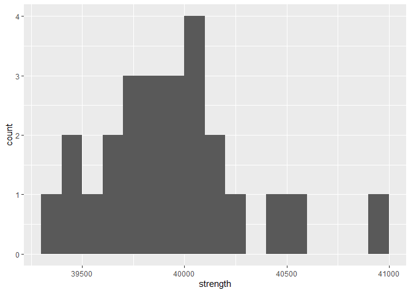

Structural Safety
================
Maya Sivanandan
2023

- <a href="#grading-rubric" id="toc-grading-rubric">Grading Rubric</a>
  - <a href="#individual" id="toc-individual">Individual</a>
  - <a href="#due-date" id="toc-due-date">Due Date</a>
- <a href="#setup" id="toc-setup">Setup</a>
  - <a
    href="#q1-visualize-the-strength-data-with-a-histogram-answer-the-questions-below"
    id="toc-q1-visualize-the-strength-data-with-a-histogram-answer-the-questions-below"><strong>q1</strong>
    Visualize the strength data with a histogram. Answer the questions
    below.</a>
- <a href="#assessing-structural-safety"
  id="toc-assessing-structural-safety">Assessing Structural Safety</a>
  - <a href="#structural-model" id="toc-structural-model">Structural
    model</a>
    - <a
      href="#q2-using-the-observations-in-df_samples-and-the-structural-model-g_break-estimate-the-probability-of-failure"
      id="toc-q2-using-the-observations-in-df_samples-and-the-structural-model-g_break-estimate-the-probability-of-failure"><strong>q2</strong>
      Using the observations in <code>df_samples</code> and the structural
      model <code>g_break()</code>, estimate the probability of failure.</a>
  - <a href="#material-property-model"
    id="toc-material-property-model">Material property model</a>
    - <a
      href="#q3-fit-a-lognormal-distribution-to-the-strength-data-using-the-fitdistr-function"
      id="toc-q3-fit-a-lognormal-distribution-to-the-strength-data-using-the-fitdistr-function"><strong>q3</strong>
      Fit a lognormal distribution to the strength data using the
      <code>fitdistr()</code> function.</a>
    - <a
      href="#q4-complete-the-code-below-by-1-choosing-a-monte-carlo-sample-size-n_monte_carlo-2-extracting-the-estimated-parameters-from-q3-and-3-computing-the-limit-state-value-g--g_break-answer-the-questions-under-observations-below"
      id="toc-q4-complete-the-code-below-by-1-choosing-a-monte-carlo-sample-size-n_monte_carlo-2-extracting-the-estimated-parameters-from-q3-and-3-computing-the-limit-state-value-g--g_break-answer-the-questions-under-observations-below"><strong>q4</strong>
      Complete the code below by 1. choosing a Monte Carlo sample size
      <code>n_monte_carlo</code>, 2. extracting the estimated parameters from
      q3, and 3. computing the limit state value <code>g = g_break()</code>.
      Answer the questions under <em>observations</em> below.</a>
  - <a href="#a-different-way-to-compute-the-pof"
    id="toc-a-different-way-to-compute-the-pof">A different way to compute
    the POF</a>
    - <a
      href="#q5-finish-the-following-function-by-computing-the-pof-with-plnorm-answer-the-questions-under-observations-below"
      id="toc-q5-finish-the-following-function-by-computing-the-pof-with-plnorm-answer-the-questions-under-observations-below"><strong>q5</strong>
      Finish the following function by computing the POF with
      <code>plnorm()</code>. Answer the questions under <em>observations</em>
      below.</a>
  - <a href="#quantifying-sampling-uncertainty"
    id="toc-quantifying-sampling-uncertainty">Quantifying sampling
    uncertainty</a>
    - <a
      href="#q6-the-code-below-estimates-a-bootstrap-ci-on-your-pof-estimate-answer-the-questions-under-observations-below"
      id="toc-q6-the-code-below-estimates-a-bootstrap-ci-on-your-pof-estimate-answer-the-questions-under-observations-below"><strong>q6</strong>
      The code below estimates a bootstrap CI on your POF estimate. Answer the
      questions under <em>observations</em> below.</a>

*Purpose*: Most real problems have multiple sources of uncertainty mixed
together. Untangling these different sources can be challenging, even on
a conceptual level. In this challenge we’ll study a simple problem of
structural safety, and use this small case study to untangle sources of
sampling and Monte Carlo uncertainty.

*Note*: In this challenge, I provide a lot of stub-code; you won’t have
to do too much coding. This is because I want you to *focus on answering
the conceptual questions*. The most important questions in this
challenge are: *What sources of uncertainty are you accounting for? What
sources are you not accounting for? Are those sources real or induced?*

<!-- include-rubric -->

# Grading Rubric

<!-- -------------------------------------------------- -->

Unlike exercises, **challenges will be graded**. The following rubrics
define how you will be graded, both on an individual and team basis.

## Individual

<!-- ------------------------- -->

| Category    | Needs Improvement                                                                                                | Satisfactory                                                                                                               |
|-------------|------------------------------------------------------------------------------------------------------------------|----------------------------------------------------------------------------------------------------------------------------|
| Effort      | Some task **q**’s left unattempted                                                                               | All task **q**’s attempted                                                                                                 |
| Observed    | Did not document observations, or observations incorrect                                                         | Documented correct observations based on analysis                                                                          |
| Supported   | Some observations not clearly supported by analysis                                                              | All observations clearly supported by analysis (table, graph, etc.)                                                        |
| Assessed    | Observations include claims not supported by the data, or reflect a level of certainty not warranted by the data | Observations are appropriately qualified by the quality & relevance of the data and (in)conclusiveness of the support      |
| Specified   | Uses the phrase “more data are necessary” without clarification                                                  | Any statement that “more data are necessary” specifies which *specific* data are needed to answer what *specific* question |
| Code Styled | Violations of the [style guide](https://style.tidyverse.org/) hinder readability                                 | Code sufficiently close to the [style guide](https://style.tidyverse.org/)                                                 |

## Due Date

<!-- ------------------------- -->

All the deliverables stated in the rubrics above are due **at midnight**
before the day of the class discussion of the challenge. See the
[Syllabus](https://docs.google.com/document/d/1qeP6DUS8Djq_A0HMllMqsSqX3a9dbcx1/edit?usp=sharing&ouid=110386251748498665069&rtpof=true&sd=true)
for more information.

# Setup

<!-- ----------------------------------------------------------------------- -->

``` r
library(MASS)
```

    ## Warning: package 'MASS' was built under R version 4.2.3

``` r
library(rsample)
library(broom)
```

    ## Warning: package 'broom' was built under R version 4.2.3

``` r
library(tidyverse)
```

    ## Warning: package 'tidyverse' was built under R version 4.2.3

    ## Warning: package 'ggplot2' was built under R version 4.2.3

    ## Warning: package 'tibble' was built under R version 4.2.3

    ## Warning: package 'tidyr' was built under R version 4.2.3

    ## Warning: package 'readr' was built under R version 4.2.3

    ## Warning: package 'dplyr' was built under R version 4.2.3

    ## Warning: package 'forcats' was built under R version 4.2.3

    ## Warning: package 'lubridate' was built under R version 4.2.3

    ## ── Attaching core tidyverse packages ──────────────────────── tidyverse 2.0.0 ──
    ## ✔ dplyr     1.1.1     ✔ readr     2.1.4
    ## ✔ forcats   1.0.0     ✔ stringr   1.5.0
    ## ✔ ggplot2   3.4.2     ✔ tibble    3.2.1
    ## ✔ lubridate 1.9.2     ✔ tidyr     1.3.0
    ## ✔ purrr     1.0.1     
    ## ── Conflicts ────────────────────────────────────────── tidyverse_conflicts() ──
    ## ✖ dplyr::filter() masks stats::filter()
    ## ✖ dplyr::lag()    masks stats::lag()
    ## ✖ dplyr::select() masks MASS::select()
    ## ℹ Use the ]8;;http://conflicted.r-lib.org/conflicted package]8;; to force all conflicts to become errors

``` r
filename_samples <- "./data/al_samples.csv"
```

*Background*: The
[strength](https://en.wikipedia.org/wiki/Ultimate_tensile_strength) of a
material is the amount of mechanical stress it can survive before
breaking. To illustrate: Stresses are internal forces that hold an
object together when we try to squeeze, stretch, or otherwise deform a
solid object. For instance, if we pull on a rectangular bar of material,
internal stresses $\sigma$ work to keep the bar together.


By Jorge Stolfi - Own work, CC BY-SA 3.0,
<https://commons.wikimedia.org/w/index.php?curid=24499456>

*Strength* is a measure of how much internal stress an object can
survive: A higher strength means a stronger material. This challenge’s
data are very simple: They are (synthetic) observations of ultimate
tensile strength (UTS) on individual samples of the same aluminum alloy.
The experiments were carried out following the highest standards of
experimental rigor, so you should consider these values to be the “true”
breaking strength for each sample.

``` r
## NOTE: No need to edit; load data
df_samples <- read_csv(filename_samples)
```

    ## Rows: 25 Columns: 1
    ## ── Column specification ────────────────────────────────────────────────────────
    ## Delimiter: ","
    ## dbl (1): strength
    ## 
    ## ℹ Use `spec()` to retrieve the full column specification for this data.
    ## ℹ Specify the column types or set `show_col_types = FALSE` to quiet this message.

``` r
df_samples
```

    ## # A tibble: 25 × 1
    ##    strength
    ##       <dbl>
    ##  1   39484.
    ##  2   39812.
    ##  3   40052.
    ##  4   40519.
    ##  5   40045.
    ##  6   40160.
    ##  7   40094.
    ##  8   39674.
    ##  9   40144.
    ## 10   39865.
    ## # ℹ 15 more rows

Data Dictionary:

| Quantity       | Units |
|----------------|-------|
| Strength (UTS) | psi   |

### **q1** Visualize the strength data with a histogram. Answer the questions below.

``` r
df_samples %>%
  ggplot(aes(strength)) +
  geom_histogram(binwidth = 100, boundary = 0.005)
```

<!-- -->

**Observations**:

- What is the mean strength of the material, approximately?
  - About 39900 psi
- To what extent can you tell what shape the distribution of the data
  has?
  - There are not very many data points, so the distribution of the data
    looks very different based on the bin size of the histogram. With a
    `binwidth` of 100 or 120, the distribution looks somewhat similar to
    a normal distribution.
- Assuming the scopus is the strength of an individual part made from
  this aluminum alloy, is the observed variability real or induced?
  - The variability would be real since the measurements because the
    measurements were taken in accordance with the “highest standards of
    experimental rigor”

# Assessing Structural Safety

<!-- ----------------------------------------------------------------------- -->

*Objective*: In this challenge you are going to study a structure and
assess its *probability of failure* (POF). A higher POF corresponds to a
more unsafe structure. Ultimately, we want

$$\text{POF} < 0.03.$$

Your job is to assess a given structure using the data provided and
determine whether you can *confidently* conclude that `POF < 0.03`.

## Structural model

<!-- --------------------------------------- -->

The following code chunk sets up a structural model: We are considering
a rectangular bar under uniaxial tensile load (as pictured above). A
larger cross-sectional area `A` is capable of surviving a greater load
`L`, but a larger `A` is a heavier (more expensive) structure. The
internal stress is approximately `sigma = L / A`—we simply compare this
quantity against the strength.

I pick particular values for `A, L` and package all the information in
the *limit state function* `g_break`:

``` r
## NOTE: No need to edit; model setup
A <- 0.0255 # Cross-sectional area
L <- 1000 # Applied load (lbs)

g_break <- function(strength) {
  strength - L / A
}
```

The *probability of failure* (POF) is then defined in terms of the limit
state $g$ via:

$$\text{POF} \equiv \mathbb{P}[g \leq 0].$$

### **q2** Using the observations in `df_samples` and the structural model `g_break()`, estimate the probability of failure.

*Hint*: In `c07-monte-carlo` you learned how to estimate a probability
as the `mean()` of an indicator. Use the same strategy here.

``` r
## TODO: Estimate the probability of failure; i.e. POF = Pr[g <= 0]
stats <- 
  df_samples %>% 
  g_break()

POF <- 
  mean(stats <= 0)
POF
```

    ## [1] 0

**Observations**:

- Does this estimate satisfy `POF < 0.03`?
  - Yes since POF = 0
- Is this estimate of the probability of failure trustworthy? Why or why
  not?
  - I don’t think I trust this estimate of the probability of failure
    since assuming `POF = 0` is trustworthy means that we believe this
    part will never break, which a big assumption to be made from only
    25 data points.
- Can you confidently conclude that `POF < 0.03`? Why or why not.
  - I would not confidently conclude that POF \< 0.03 since I don’t find
    the estimated POF to be trustworthy given that it was calculated
    from so few data points (25)

## Material property model

<!-- --------------------------------------- -->

Since we have so few physical samples, we will fit a distribution to
model the material property. This will give us the means to draw
“virtual samples” and use those to estimate the POF.

### **q3** Fit a lognormal distribution to the strength data using the `fitdistr()` function.

*Note*: In this challenge I generated the `strength` data from a
`lognormal` distribution; if you didn’t know that fact, then the choice
of distribution would be an *additional* source of uncertainty!

*Hint 1*: We learned how to do this in `e-stat08-fit-dist`.

*Hint 2*: The `fitdistr` function uses `densfun = "lognormal"` to
specify a lognormal distribution.

``` r
## TODO:
df_fit <- 
  fitdistr(df_samples$strength, densfun = "lognormal")

df_fit
```

    ##      meanlog         sdlog    
    ##   10.595117912    0.008750493 
    ##  ( 0.001750099) ( 0.001237507)

Once you’ve successfully fit a model for the strength, you can estimate
the probability of failure by drawing samples from the fitted
distribution.

### **q4** Complete the code below by 1. choosing a Monte Carlo sample size `n_monte_carlo`, 2. extracting the estimated parameters from q3, and 3. computing the limit state value `g = g_break()`. Answer the questions under *observations* below.

*Hint 1*: You will need to combine ideas from `c07-monte-carlo` and
`e-stat08-fit-dist` in order to complete this task.

*Hint 2*: The function `rlnorm()` will allow you to draw samples from a
lognormal distribution.

``` r
## TODO 1: Choose Monte Carlo sample size
n_monte_carlo <- 10000

## TODO 2: Extract parameter estimates from df_fit
strength_meanlog <- df_fit$estimate[1]
strength_sdlog <- df_fit$estimate[2]

set.seed(739)
# Generate samples
df_norm_sim <-
  tibble(strength = rlnorm(n_monte_carlo, strength_meanlog, strength_sdlog)) %>%
## TODO 3: Compute structural response
  glimpse()
```

    ## Rows: 10,000
    ## Columns: 1
    ## $ strength <dbl> 40430.41, 39829.40, 39862.28, 39490.06, 39866.47, 39801.45, 4…

``` r
## NOTE: The following code estimates the POF and a 95% confidence interval
df_norm_pof <-
  df_norm_sim %>%
  mutate(stat = g_break(strength) <= 0) %>%
  summarize(
    pof_est = mean(stat),
    se = sd(stat) / sqrt(n_monte_carlo)
  ) %>%
  mutate(
    pof_lo = pof_est - 1.96 * se,
    pof_hi = pof_est + 1.96 * se
  ) %>%
  select(pof_lo, pof_est, pof_hi)

df_norm_pof
```

    ## # A tibble: 1 × 3
    ##   pof_lo pof_est pof_hi
    ##    <dbl>   <dbl>  <dbl>
    ## 1 0.0166  0.0193 0.0220

- Assuming your scopus is the probability of failure `POF` defined
  above, does your estimate exhibit real variability, induced
  variability, or both?
  - Induced variability which comes from the small sample size
- Does this confidence interval imply that `POF < 0.03`?
  - Yes because even the highest estimate of POF is less than 0.03
    (0.022)
- Compare this probability with your estimate from q2; is it more or
  less trustworthy?
  - I would say this result is more trustworthy because it based off of
    400X more data points, and these data points are generated to follow
    similar trends of the “real” data collected from experiments (having
    the same mean and standard deviation).
- Does the confidence interval above account for uncertainty arising
  from the *Monte Carlo approximation*? Why or why not?
  - Yes because we use standard error across all Monte Carlo samples
- Does the confidence interval above account for uncertainty arising
  from *limited physical tests* (`df_samples`)? Why or why not?
  - I think it does to some degree since it is now using many more data
    points than were used in `q2`; however, the approximation is still
    based off of only 25 measurements.
- What could you do to tighten up the confidence interval?
  - Potentially generate more values with the Monte Carlo approximation
    or collect more physical measurements
- Can you *confidently* conclude that `POF < 0.03`? Why or why not?
  - No because there’s hasn’t been anything done to try and calculate
    the uncertainty from the Monte Carlo approximation. If I knew a
    little more about the approximation compares to the experimentally
    measured data, I could be more confident.

## A different way to compute the POF

<!-- --------------------------------------- -->

Monte Carlo is a *general* way to estimate probabilities, but it
introduces approximation error. It turns out that, for the simple
problem we’re studying, we can compute the probability directly using
the CDF. Note that for our structural safety problem, we have

$$\text{POF} = \mathbb{P}[g \leq 0] = \mathbb{P}[S \leq L / A] = \text{CDF}_S(L/A).$$

Since
`S = rlnorm(n, meanlog = strength_meanlog, sdlog = strength_sdlog)`, we
can use `plnorm` to compute the probability of failure without Monte
Carlo as
`POF = plnorm(L/A, meanlog = strength_meanlog, sdlog = strength_sdlog)`.
Let’s combine this idea with the fitted distribution to estimate the
POF.

### **q5** Finish the following function by computing the POF with `plnorm()`. Answer the questions under *observations* below.

``` r
## TODO: Complete the function below;
##       note that you only need to edit the TODO section

estimate_pof <- function(df) {
  ## Fit the distribution
  df_fit <-
    df %>%
    pull(strength) %>%
    fitdistr(densfun = "lognormal") %>%
    tidy()

  ## Extract the parameters
  strength_meanlog <-
    df_fit %>%
    filter(term == "meanlog") %>%
    pull(estimate)
  strength_sdlog <-
    df_fit %>%
    filter(term == "sdlog") %>%
    pull(estimate)

## TODO: Estimate the probability of failure using plnorm
  pof_estimate <- plnorm(L/A, meanlog = strength_meanlog, sdlog = strength_sdlog)

  ## NOTE: No need to edit; this last line returns your pof_estimate
  pof_estimate
}

## NOTE: No need to edit; test your function
df_samples %>% estimate_pof()
```

    ## [1] 0.01832289

**Observations**:

- How does this estimate compare with your Monte Carlo estimate above?
  - It is slightly lower (about 0.001)
- Does this estimate have any uncertainty due to *Monte Carlo
  approximation*? Why or why not?
  - No because there is no Monte Carlo approximation and the function
    fit is based directly on the 25 measured data points
- With the scopus as the `POF`, would uncertainty due to *Monte Carlo
  approximation* be induced or real?
  - It would be induced because it comes from the process we do to
    collect the data samples.
- Does this estimate have any uncertainty due to *limited physical
  tests*? Why or why not?
  - Yes because the function model is only based off the 25 measurements
    from the physical tests
- With the scopus as the `POF`, would uncertainty due to *limited
  physical tests* be induced or real?
  - The physical tests are susceptible to both real and induced
    uncertainty (uncertainty from the manufacturing process and
    uncertainty from taking the measurements, respectively), but the
    uncertainty from limited physical tests is more specifically related
    to the induced uncertainty.

## Quantifying sampling uncertainty

<!-- --------------------------------------- -->

Using `plnorm()` gets rid of Monte Carlo error, but we still have
uncertainty due to limited physical testing. Often we can use a CLT
approximation to construct a confidence interval. However, with
`plnorm()` we can’t use a CLT approximation because it does not follow
the assumptions of the central limit theorem (it’s not a sum of iid
random variables). Instead, we can use the *bootstrap* to approximate a
confidence interval via resampling.

### **q6** The code below estimates a bootstrap CI on your POF estimate. Answer the questions under *observations* below.

``` r
## NOTE: No need to edit; run and inspect
tidycustom <- function(est) {tibble(term = "pof", estimate = est)}

df_samples %>%
  bootstraps(times = 1000) %>%
  mutate(
    estimates = map(
      splits,
      ~ analysis(.x) %>% estimate_pof() %>% tidycustom()
    )
  ) %>%
  int_pctl(estimates)
```

    ## # A tibble: 1 × 6
    ##   term   .lower .estimate .upper .alpha .method   
    ##   <chr>   <dbl>     <dbl>  <dbl>  <dbl> <chr>     
    ## 1 pof   0.00118    0.0181 0.0492   0.05 percentile

**Observations**:

- Does the confidence interval above account for uncertainty arising
  from *Monte Carlo approximation* of the POF? Why or why not?
  - No because estimating POF with `pl_norm()` removed the Monte Carlo
    error
- Does the confidence interval above account for uncertainty arising
  from *limited physical tests* (`df_samples`)? Why or why not?
  - Yes because we conducted bootstrap analysis
- Can you confidently conclude that `POF < 0.03`? Why or why not?
  - No because the upper confidence interval is \~0.04915, so the true
    POF is not guaranteed to be less than 0.03
