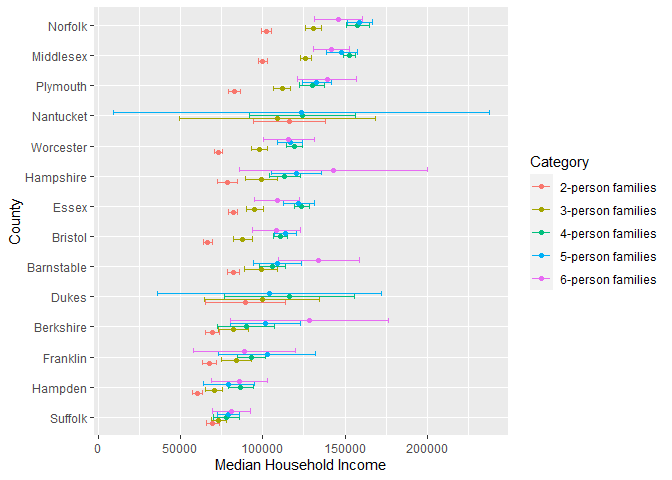
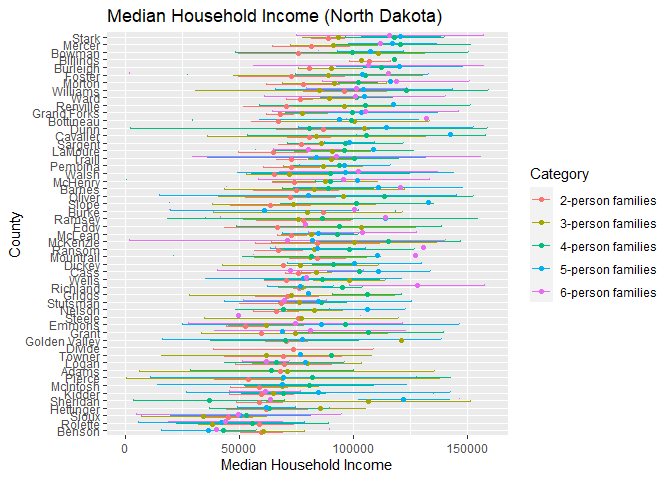

US Income
================
Maya Sivanandan
2023

- <a href="#grading-rubric" id="toc-grading-rubric">Grading Rubric</a>
  - <a href="#individual" id="toc-individual">Individual</a>
  - <a href="#due-date" id="toc-due-date">Due Date</a>
- <a href="#setup" id="toc-setup">Setup</a>
  - <a
    href="#q1-load-the-population-data-from-c06-simply-replace-filename_pop-below"
    id="toc-q1-load-the-population-data-from-c06-simply-replace-filename_pop-below"><strong>q1</strong>
    Load the population data from c06; simply replace
    <code>filename_pop</code> below.</a>
  - <a href="#q2-obtain-median-income-data-from-the-census-bureau"
    id="toc-q2-obtain-median-income-data-from-the-census-bureau"><strong>q2</strong>
    Obtain median income data from the Census Bureau:</a>
  - <a
    href="#q3-tidy-the-df_income-dataset-by-completing-the-code-below-pivot-and-rename-the-columns-to-arrive-at-the-column-names-id-geographic_area_name-category-income_estimate-income_moe"
    id="toc-q3-tidy-the-df_income-dataset-by-completing-the-code-below-pivot-and-rename-the-columns-to-arrive-at-the-column-names-id-geographic_area_name-category-income_estimate-income_moe"><strong>q3</strong>
    Tidy the <code>df_income</code> dataset by completing the code below.
    Pivot and rename the columns to arrive at the column names
    <code>id, geographic_area_name, category, income_estimate, income_moe</code>.</a>
  - <a
    href="#q4-convert-the-margin-of-error-to-standard-error-additionally-compute-a-99-confidence-interval-on-income-and-normalize-the-standard-error-to-income_cv--income_se--income_estimate-provide-these-columns-with-the-names-income_se-income_lo-income_hi-income_cv"
    id="toc-q4-convert-the-margin-of-error-to-standard-error-additionally-compute-a-99-confidence-interval-on-income-and-normalize-the-standard-error-to-income_cv--income_se--income_estimate-provide-these-columns-with-the-names-income_se-income_lo-income_hi-income_cv"><strong>q4</strong>
    Convert the margin of error to standard error. Additionally, compute a
    99% confidence interval on income, and normalize the standard error to
    <code>income_CV = income_SE / income_estimate</code>. Provide these
    columns with the names
    <code>income_SE, income_lo, income_hi, income_CV</code>.</a>
  - <a href="#q5-join-df_q4-and-df_pop"
    id="toc-q5-join-df_q4-and-df_pop"><strong>q5</strong> Join
    <code>df_q4</code> and <code>df_pop</code>.</a>
- <a href="#analysis" id="toc-analysis">Analysis</a>
  - <a
    href="#q6-study-the-following-graph-making-sure-to-note-what-you-can-and-cant-conclude-based-on-the-estimates-and-confidence-intervals-document-your-observations-below-and-answer-the-questions"
    id="toc-q6-study-the-following-graph-making-sure-to-note-what-you-can-and-cant-conclude-based-on-the-estimates-and-confidence-intervals-document-your-observations-below-and-answer-the-questions"><strong>q6</strong>
    Study the following graph, making sure to note what you can <em>and
    can’t</em> conclude based on the estimates and confidence intervals.
    Document your observations below and answer the questions.</a>
  - <a
    href="#q7-plot-the-standard-error-against-population-for-all-counties-create-a-visual-that-effectively-highlights-the-trends-in-the-data-answer-the-questions-under-observations-below"
    id="toc-q7-plot-the-standard-error-against-population-for-all-counties-create-a-visual-that-effectively-highlights-the-trends-in-the-data-answer-the-questions-under-observations-below"><strong>q7</strong>
    Plot the standard error against population for all counties. Create a
    visual that effectively highlights the trends in the data. Answer the
    questions under <em>observations</em> below.</a>
- <a href="#going-further" id="toc-going-further">Going Further</a>
  - <a
    href="#q8-pose-your-own-question-about-the-data-create-a-visualization-or-table-here-and-document-your-observations"
    id="toc-q8-pose-your-own-question-about-the-data-create-a-visualization-or-table-here-and-document-your-observations"><strong>q8</strong>
    Pose your own question about the data. Create a visualization (or table)
    here, and document your observations.</a>

*Purpose*: We’ve been learning how to quantify uncertainty in estimates
through the exercises; now its time to put those skills to use studying
real data. In this challenge we’ll use concepts like confidence
intervals to help us make sense of census data.

*Reading*: - [Using ACS Estimates and Margin of
Error](https://www.census.gov/programs-surveys/acs/guidance/training-presentations/acs-moe.html)
(Optional) - [Patterns and Causes of Uncertainty in the American
Community
Survey](https://www.sciencedirect.com/science/article/pii/S0143622813002518?casa_token=VddzQ1-spHMAAAAA:FTq92LXgiPVloJUVjnHs8Ma1HwvPigisAYtzfqaGbbRRwoknNq56Y2IzszmGgIGH4JAPzQN0)
(Optional, particularly the *Uncertainty in surveys* section under the
Introduction.)

<!-- include-rubric -->

# Grading Rubric

<!-- -------------------------------------------------- -->

Unlike exercises, **challenges will be graded**. The following rubrics
define how you will be graded, both on an individual and team basis.

## Individual

<!-- ------------------------- -->

| Category    | Needs Improvement                                                                                                | Satisfactory                                                                                                               |
|-------------|------------------------------------------------------------------------------------------------------------------|----------------------------------------------------------------------------------------------------------------------------|
| Effort      | Some task **q**’s left unattempted                                                                               | All task **q**’s attempted                                                                                                 |
| Observed    | Did not document observations, or observations incorrect                                                         | Documented correct observations based on analysis                                                                          |
| Supported   | Some observations not clearly supported by analysis                                                              | All observations clearly supported by analysis (table, graph, etc.)                                                        |
| Assessed    | Observations include claims not supported by the data, or reflect a level of certainty not warranted by the data | Observations are appropriately qualified by the quality & relevance of the data and (in)conclusiveness of the support      |
| Specified   | Uses the phrase “more data are necessary” without clarification                                                  | Any statement that “more data are necessary” specifies which *specific* data are needed to answer what *specific* question |
| Code Styled | Violations of the [style guide](https://style.tidyverse.org/) hinder readability                                 | Code sufficiently close to the [style guide](https://style.tidyverse.org/)                                                 |

## Due Date

<!-- ------------------------- -->

All the deliverables stated in the rubrics above are due **at midnight**
before the day of the class discussion of the challenge. See the
[Syllabus](https://docs.google.com/document/d/1qeP6DUS8Djq_A0HMllMqsSqX3a9dbcx1/edit?usp=sharing&ouid=110386251748498665069&rtpof=true&sd=true)
for more information.

# Setup

<!-- ----------------------------------------------------------------------- -->

``` r
library(tidyverse)
```

    ## Warning: package 'tidyverse' was built under R version 4.2.3

    ## Warning: package 'ggplot2' was built under R version 4.2.3

    ## Warning: package 'tibble' was built under R version 4.2.3

    ## Warning: package 'tidyr' was built under R version 4.2.3

    ## Warning: package 'readr' was built under R version 4.2.3

    ## Warning: package 'dplyr' was built under R version 4.2.3

    ## Warning: package 'forcats' was built under R version 4.2.3

    ## Warning: package 'lubridate' was built under R version 4.2.3

    ## ── Attaching core tidyverse packages ──────────────────────── tidyverse 2.0.0 ──
    ## ✔ dplyr     1.1.1     ✔ readr     2.1.4
    ## ✔ forcats   1.0.0     ✔ stringr   1.5.0
    ## ✔ ggplot2   3.4.2     ✔ tibble    3.2.1
    ## ✔ lubridate 1.9.2     ✔ tidyr     1.3.0
    ## ✔ purrr     1.0.1     
    ## ── Conflicts ────────────────────────────────────────── tidyverse_conflicts() ──
    ## ✖ dplyr::filter() masks stats::filter()
    ## ✖ dplyr::lag()    masks stats::lag()
    ## ℹ Use the ]8;;http://conflicted.r-lib.org/conflicted package]8;; to force all conflicts to become errors

``` r
library(ggpubr)
```

    ## Warning: package 'ggpubr' was built under R version 4.2.3

``` r
library("stringr") 
```

### **q1** Load the population data from c06; simply replace `filename_pop` below.

``` r
## TODO: Give the filename for your copy of Table B01003
filename_pop <- 'data/ACSDT5Y2018.B01003-Data.csv'

## NOTE: No need to edit
df_pop <-
  read_csv(
    filename_pop,
    skip = 2,
    col_names = c(
      "id",
      "geographic_area_name",
      "population_estimate",
      "population_moe"
    )
  )
```

    ## Rows: 3220 Columns: 6
    ## ── Column specification ────────────────────────────────────────────────────────
    ## Delimiter: ","
    ## chr (5): id, geographic_area_name, population_moe, X5, X6
    ## dbl (1): population_estimate
    ## 
    ## ℹ Use `spec()` to retrieve the full column specification for this data.
    ## ℹ Specify the column types or set `show_col_types = FALSE` to quiet this message.

``` r
df_pop
```

    ## # A tibble: 3,220 × 6
    ##    id        geographic_area_name population_estimate population_moe X5    X6   
    ##    <chr>     <chr>                              <dbl> <chr>          <chr> <chr>
    ##  1 0500000U… Autauga County, Ala…               55200 null           ***** *****
    ##  2 0500000U… Baldwin County, Ala…              208107 null           ***** *****
    ##  3 0500000U… Barbour County, Ala…               25782 null           ***** *****
    ##  4 0500000U… Bibb County, Alabama               22527 null           ***** *****
    ##  5 0500000U… Blount County, Alab…               57645 null           ***** *****
    ##  6 0500000U… Bullock County, Ala…               10352 null           ***** *****
    ##  7 0500000U… Butler County, Alab…               20025 null           ***** *****
    ##  8 0500000U… Calhoun County, Ala…              115098 null           ***** *****
    ##  9 0500000U… Chambers County, Al…               33826 null           ***** *****
    ## 10 0500000U… Cherokee County, Al…               25853 null           ***** *****
    ## # ℹ 3,210 more rows

You might wonder why the `Margin of Error` in the population estimates
is listed as `*****`. From the [documentation (PDF
link)](https://www.google.com/url?sa=t&rct=j&q=&esrc=s&source=web&cd=&cad=rja&uact=8&ved=2ahUKEwj81Omy16TrAhXsguAKHTzKDQEQFjABegQIBxAB&url=https%3A%2F%2Fwww2.census.gov%2Fprograms-surveys%2Facs%2Ftech_docs%2Faccuracy%2FMultiyearACSAccuracyofData2018.pdf%3F&usg=AOvVaw2TOrVuBDlkDI2gde6ugce_)
for the ACS:

> If the margin of error is displayed as ‘\*\*\*\*\*’ (five asterisks),
> the estimate has been controlled to be equal to a fixed value and so
> it has no sampling error. A standard error of zero should be used for
> these controlled estimates when completing calculations, such as those
> in the following section.

This means that for cases listed as `*****` the US Census Bureau
recommends treating the margin of error (and thus standard error) as
zero.

### **q2** Obtain median income data from the Census Bureau:

- `Filter > Topics > Income and Poverty > Income and Poverty`
- `Filter > Geography > County > All counties in United States`
- Look for `Median Income in the Past 12 Months` (Table S1903)
- Download the 2018 5-year ACS estimates; save to your `data` folder and
  add the filename below.

``` r
## TODO: Give the filename for your copy of Table S1903
filename_income <- 'data/ACSST5Y2018.S1903-Data.csv'

## NOTE: No need to edit
df_income <-
  read_csv(filename_income, skip = 1)
```

    ## New names:
    ## • `` -> `...483`

    ## Warning: One or more parsing issues, call `problems()` on your data frame for details,
    ## e.g.:
    ##   dat <- vroom(...)
    ##   problems(dat)

    ## Rows: 3220 Columns: 483
    ## ── Column specification ────────────────────────────────────────────────────────
    ## Delimiter: ","
    ## chr (306): Geography, Geographic Area Name, Annotation of Margin of Error!!N...
    ## dbl (176): Estimate!!Number!!HOUSEHOLD INCOME BY RACE AND HISPANIC OR LATINO...
    ## lgl   (1): ...483
    ## 
    ## ℹ Use `spec()` to retrieve the full column specification for this data.
    ## ℹ Specify the column types or set `show_col_types = FALSE` to quiet this message.

``` r
df_income
```

    ## # A tibble: 3,220 × 483
    ##    Geography      `Geographic Area Name`   Estimate!!Number!!HOUSEHOLD INCOME …¹
    ##    <chr>          <chr>                                                    <dbl>
    ##  1 0500000US01001 Autauga County, Alabama                                  21115
    ##  2 0500000US01003 Baldwin County, Alabama                                  78622
    ##  3 0500000US01005 Barbour County, Alabama                                   9186
    ##  4 0500000US01007 Bibb County, Alabama                                      6840
    ##  5 0500000US01009 Blount County, Alabama                                   20600
    ##  6 0500000US01011 Bullock County, Alabama                                   3609
    ##  7 0500000US01013 Butler County, Alabama                                    6708
    ##  8 0500000US01015 Calhoun County, Alabama                                  45033
    ##  9 0500000US01017 Chambers County, Alabama                                 13516
    ## 10 0500000US01019 Cherokee County, Alabama                                 10606
    ## # ℹ 3,210 more rows
    ## # ℹ abbreviated name:
    ## #   ¹​`Estimate!!Number!!HOUSEHOLD INCOME BY RACE AND HISPANIC OR LATINO ORIGIN OF HOUSEHOLDER!!Households`
    ## # ℹ 480 more variables:
    ## #   `Margin of Error!!Number MOE!!HOUSEHOLD INCOME BY RACE AND HISPANIC OR LATINO ORIGIN OF HOUSEHOLDER!!Households` <dbl>,
    ## #   `Annotation of Margin of Error!!Number MOE!!HOUSEHOLD INCOME BY RACE AND HISPANIC OR LATINO ORIGIN OF HOUSEHOLDER!!Households` <chr>,
    ## #   `Annotation of Estimate!!Number!!HOUSEHOLD INCOME BY RACE AND HISPANIC OR LATINO ORIGIN OF HOUSEHOLDER!!Households` <chr>, …

Use the following test to check that you downloaded the correct file:

``` r
## NOTE: No need to edit, use to check you got the right file.
assertthat::assert_that(
  df_income %>%
    filter(Geography == "0500000US01001") %>%
    pull(`Estimate!!Percent Distribution!!FAMILY INCOME BY FAMILY SIZE!!2-person families`)
  == 45.6
)
```

    ## [1] TRUE

``` r
print("Well done!")
```

    ## [1] "Well done!"

This dataset is in desperate need of some *tidying*. To simplify the
task, we’ll start by considering the `\\d-person families` columns
first.

### **q3** Tidy the `df_income` dataset by completing the code below. Pivot and rename the columns to arrive at the column names `id, geographic_area_name, category, income_estimate, income_moe`.

*Hint*: You can do this in a single pivot using the `".value"` argument
and a `names_pattern` using capture groups `"()"`. Remember that you can
use an OR operator `|` in a regex to allow for multiple possibilities in
a capture group, for example `"(Estimate|Margin of Error)"`.

``` r
df_q3 <-
  df_income %>%
  select(
    contains("Geograph"),
    contains("median") & matches("\\d-person families"),
    -contains("Annotation")
  ) %>%
  mutate(across(contains("median"), as.numeric)) %>%
  pivot_longer(
    names_pattern = "(Estimate|Margin of Error).*(\\d-person families)",
    names_to = c(".value", "Category"),
    cols = c(-contains("Geograph"))
  )
```

    ## Warning: There were 8 warnings in `mutate()`.
    ## The first warning was:
    ## ℹ In argument: `across(contains("median"), as.numeric)`.
    ## Caused by warning:
    ## ! NAs introduced by coercion
    ## ℹ Run ]8;;ide:run:dplyr::last_dplyr_warnings()dplyr::last_dplyr_warnings()]8;; to see the 7 remaining warnings.

``` r
  # ) %>% 
  # glimpse()
df_q3
```

    ## # A tibble: 16,100 × 5
    ##    Geography      `Geographic Area Name`  Category    Estimate `Margin of Error`
    ##    <chr>          <chr>                   <chr>          <dbl>             <dbl>
    ##  1 0500000US01001 Autauga County, Alabama 2-person f…    64947              6663
    ##  2 0500000US01001 Autauga County, Alabama 3-person f…    80172             14181
    ##  3 0500000US01001 Autauga County, Alabama 4-person f…    85455             10692
    ##  4 0500000US01001 Autauga County, Alabama 5-person f…    88601             20739
    ##  5 0500000US01001 Autauga County, Alabama 6-person f…   103787             12387
    ##  6 0500000US01003 Baldwin County, Alabama 2-person f…    63975              2297
    ##  7 0500000US01003 Baldwin County, Alabama 3-person f…    79390              8851
    ##  8 0500000US01003 Baldwin County, Alabama 4-person f…    88458              5199
    ##  9 0500000US01003 Baldwin County, Alabama 5-person f…    91259              7011
    ## 10 0500000US01003 Baldwin County, Alabama 6-person f…    69609             23175
    ## # ℹ 16,090 more rows

Use the following tests to check your work:

``` r
## NOTE: No need to edit
assertthat::assert_that(setequal(
  names(df_q3),
  c("Geography", "Geographic Area Name", "Category", "Estimate", "Margin of Error")
))
```

    ## [1] TRUE

``` r
assertthat::assert_that(
  df_q3 %>%
    filter(Geography == "0500000US01001", Category == "2-person families") %>%
    pull(`Margin of Error`)
  == 6663
)
```

    ## [1] TRUE

``` r
print("Nice!")
```

    ## [1] "Nice!"

The data gives finite values for the Margin of Error, which is closely
related to the Standard Error. The Census Bureau documentation gives the
following relationship between Margin of Error and Standard Error:

$$\text{MOE} = 1.645 \times \text{SE}.$$

### **q4** Convert the margin of error to standard error. Additionally, compute a 99% confidence interval on income, and normalize the standard error to `income_CV = income_SE / income_estimate`. Provide these columns with the names `income_SE, income_lo, income_hi, income_CV`.

``` r
df_q4 <-
  df_q3 %>% 
  mutate(
    income_SE = (`Margin of Error`/1.645),
    income_lo = Estimate - (income_SE*2.576),
    income_hi = Estimate + (income_SE*2.576),
    income_CV = income_SE/Estimate
  )
```

Use the following tests to check your work:

``` r
## NOTE: No need to edit
assertthat::assert_that(setequal(
  names(df_q4),
  c("Geography", "Geographic Area Name", "Category", "Estimate", "Margin of Error",
    "income_SE", "income_lo", "income_hi", "income_CV")
))
```

    ## [1] TRUE

``` r
assertthat::assert_that(
  abs(
    df_q4 %>%
    filter(Geography == "0500000US01001", Category == "2-person families") %>%
    pull(income_SE) - 4050.456
  ) / 4050.456 < 1e-3
)
```

    ## [1] TRUE

``` r
assertthat::assert_that(
  abs(
    df_q4 %>%
    filter(Geography == "0500000US01001", Category == "2-person families") %>%
    pull(income_lo) - 54513.72
  ) / 54513.72 < 1e-3
)
```

    ## [1] TRUE

``` r
assertthat::assert_that(
  abs(
    df_q4 %>%
    filter(Geography == "0500000US01001", Category == "2-person families") %>%
    pull(income_hi) - 75380.28
  ) / 75380.28 < 1e-3
)
```

    ## [1] TRUE

``` r
assertthat::assert_that(
  abs(
    df_q4 %>%
    filter(Geography == "0500000US01001", Category == "2-person families") %>%
    pull(income_CV) - 0.06236556
  ) / 0.06236556 < 1e-3
)
```

    ## [1] TRUE

``` r
print("Nice!")
```

    ## [1] "Nice!"

One last wrangling step: We need to join the two datasets so we can
compare population with income.

### **q5** Join `df_q4` and `df_pop`.

``` r
## TODO: Join df_q4 and df_pop by the appropriate column


df_q4_id <-
  df_q4 %>% 
  rename(id = Geography)
# df_q4_id
# df_pop

df_data <-
  full_join(df_q4_id, df_pop, by = c("id"))
df_data
```

    ## # A tibble: 16,100 × 14
    ##    id       `Geographic Area Name` Category Estimate `Margin of Error` income_SE
    ##    <chr>    <chr>                  <chr>       <dbl>             <dbl>     <dbl>
    ##  1 0500000… Autauga County, Alaba… 2-perso…    64947              6663     4050.
    ##  2 0500000… Autauga County, Alaba… 3-perso…    80172             14181     8621.
    ##  3 0500000… Autauga County, Alaba… 4-perso…    85455             10692     6500.
    ##  4 0500000… Autauga County, Alaba… 5-perso…    88601             20739    12607.
    ##  5 0500000… Autauga County, Alaba… 6-perso…   103787             12387     7530.
    ##  6 0500000… Baldwin County, Alaba… 2-perso…    63975              2297     1396.
    ##  7 0500000… Baldwin County, Alaba… 3-perso…    79390              8851     5381.
    ##  8 0500000… Baldwin County, Alaba… 4-perso…    88458              5199     3160.
    ##  9 0500000… Baldwin County, Alaba… 5-perso…    91259              7011     4262.
    ## 10 0500000… Baldwin County, Alaba… 6-perso…    69609             23175    14088.
    ## # ℹ 16,090 more rows
    ## # ℹ 8 more variables: income_lo <dbl>, income_hi <dbl>, income_CV <dbl>,
    ## #   geographic_area_name <chr>, population_estimate <dbl>,
    ## #   population_moe <chr>, X5 <chr>, X6 <chr>

# Analysis

<!-- ----------------------------------------------------------------------- -->

We now have both estimates and confidence intervals for
`\\d-person families`. Now we can compare cases with quantified
uncertainties: Let’s practice!

### **q6** Study the following graph, making sure to note what you can *and can’t* conclude based on the estimates and confidence intervals. Document your observations below and answer the questions.

``` r
## NOTE: No need to edit; run and inspect
wid <- 0.5

df_data %>%
  filter(str_detect(geographic_area_name, "Massachusetts")) %>%
  mutate(
    county = str_remove(geographic_area_name, " County,.*$"),
    county = fct_reorder(county, Estimate)
  ) %>%

  ggplot(aes(county, Estimate, color = Category)) +
  geom_errorbar(
    aes(ymin = income_lo, ymax = income_hi),
    position = position_dodge(width = wid)
  ) +
  geom_point(position = position_dodge(width = wid)) +

  coord_flip() +
  labs(
    x = "County",
    y = "Median Household Income"
  )
```

    ## Warning: There was 1 warning in `mutate()`.
    ## ℹ In argument: `county = fct_reorder(county, Estimate)`.
    ## Caused by warning:
    ## ! `fct_reorder()` removing 2 missing values.
    ## ℹ Use `.na_rm = TRUE` to silence this message.
    ## ℹ Use `.na_rm = FALSE` to preserve NAs.

    ## Warning: Removed 2 rows containing missing values (`geom_point()`).

<!-- -->

**Observations**:

- Document your observations here.
  - Larger family data (5+ people) seems to have larger standard error
    than smaller families, likely because there are fewer samples
  - Smaller families tend to have lower median household incomes. This
    could be because there are fewer contributors to household income or
    because people sometimes try to wait until they are more financially
    stable/have higher household incomes before they have children.
    - The 6-person households seem to go against this trend, having
      their medians or margins of error be of a lower income than 4 or 5
      (or even some 2 or 3) person households.
- Can you confidently distinguish between household incomes in Suffolk
  county? Why or why not?
  - No because the margins of error for each category overlap
    significantly (meaning the true values could be anywhere within
    those ranges), so we can’t tell how family sizes affect median
    household income.
- Which counties have the widest confidence intervals?
  - Nantucket and Dukes since they have the largest margins of error
    compared to the same categories across the other counties.
  - Hampshire and Berkshire also show large margins of error, but this
    is generally only for the 6-person family category

In the next task you’ll investigate the relationship between population
and uncertainty.

### **q7** Plot the standard error against population for all counties. Create a visual that effectively highlights the trends in the data. Answer the questions under *observations* below.

*Hint*: Remember that standard error is a function of *both* variability
(e.g. variance) and sample size.

``` r
df_data %>% 
  ggplot(aes(population_estimate, income_SE, color = Category)) +
  geom_point() +
  scale_y_log10(labels = scales::label_number_si())
```

    ## Warning: `label_number_si()` was deprecated in scales 1.2.0.
    ## ℹ Please use the `scale_cut` argument of `label_number()` instead.
    ## This warning is displayed once every 8 hours.
    ## Call `lifecycle::last_lifecycle_warnings()` to see where this warning was
    ## generated.

    ## Warning: Removed 814 rows containing missing values (`geom_point()`).

<!-- -->

**Observations**:

- What *overall* trend do you see between `SE` and population? Why might
  this trend exist?
  - Overall, there is a significant pattern with counties of smaller
    population having much higher standard error, showing a trend
    similar to an inverse relationship. This likely exists because
    standard error is the standard deviation divided by the square root
    of population, so smaller populations have a larger standard error.
- What does this *overall* trend tell you about the relative ease of
  studying small vs large counties?
  - It is likely easier to study large counties and have a smaller
    standard error, since the sample size can be a smaller proportional
    of the population (compared to a smaller county) and be more likely
    to have a smaller standard error than a smaller country. Standard
    error does not account for the ratio of sample size to population
    size.

# Going Further

<!-- ----------------------------------------------------------------------- -->

Now it’s your turn! You have income data for every county in the United
States: Pose your own question and try to answer it with the data.

### **q8** Pose your own question about the data. Create a visualization (or table) here, and document your observations.

``` r
## TODO: Pose and answer your own question about the data
## Investigating how fertility rate impacts median household income

wid <- 0.5

df_data %>%
  filter(str_detect(geographic_area_name, "Vermont")) %>%
  mutate(
    county = str_remove(geographic_area_name, " County,.*$"),
    county = fct_reorder(county, Estimate)
  ) %>%

  ggplot(aes(county, Estimate, color = Category)) +
  geom_errorbar(
    aes(ymin = income_lo, ymax = income_hi),
    position = position_dodge(width = wid)
  ) +
  geom_point(position = position_dodge(width = wid)) +
  ylim(0, 160000) + 

  coord_flip() +
  labs(
    x = "County",
    y = "Median Household Income",
    title = "Median Household Income (Vermont)"
  )
```

<!-- -->

``` r
df_data %>%
  filter(str_detect(geographic_area_name, "North Dakota")) %>%
  mutate(
    county = str_remove(geographic_area_name, " County,.*$"),
    county = fct_reorder(county, Estimate)
  ) %>%

  ggplot(aes(county, Estimate, color = Category)) +
  geom_errorbar(
    aes(ymin = income_lo, ymax = income_hi),
    position = position_dodge(width = wid)
  ) +
  geom_point(position = position_dodge(width = wid)) +
  ylim(0, 160000) + 

  coord_flip() +
  labs(
    x = "County",
    y = "Median Household Income",
    title = "Median Household Income (North Dakota)"
  )
```

    ## Warning: There was 1 warning in `mutate()`.
    ## ℹ In argument: `county = fct_reorder(county, Estimate)`.
    ## Caused by warning:
    ## ! `fct_reorder()` removing 25 missing values.
    ## ℹ Use `.na_rm = TRUE` to silence this message.
    ## ℹ Use `.na_rm = FALSE` to preserve NAs.

    ## Warning: Removed 28 rows containing missing values (`geom_point()`).

<!-- -->

``` r
# df_data %>%
#   filter(str_detect(geographic_area_name, "North Dakota")) %>%
#   arrange(desc(population_estimate))
# 
# df_data %>%
#   filter(str_detect(geographic_area_name, "Vermont")) %>%
#   arrange(desc(population_estimate))


# plot_VT <-
df_data %>%
  filter(str_detect(geographic_area_name, "Vermont")) %>%
  arrange(desc(population_estimate)) %>% 
  head(50) %>% 
  mutate(
    county = str_remove(geographic_area_name, " County,.*$"),
    county = fct_reorder(county, population_estimate)
  ) %>%

  ggplot(aes(county, Estimate, color = Category)) +
  geom_errorbar(
    aes(ymin = income_lo, ymax = income_hi),
    position = position_dodge(width = wid)
  ) +
  geom_point(position = position_dodge(width = wid)) +
  ylim(0, 160000) + 

  coord_flip() +
  labs(
    x = "County",
    y = "Median Household Income",
    title = "Median Household Income - 10 Largest VT Counties"
  )
```

<!-- -->

``` r
# plot_ND <-
df_data %>%
  filter(str_detect(geographic_area_name, "North Dakota")) %>%
  arrange(desc(population_estimate)) %>% 
  head(50) %>% 
  mutate(
    county = str_remove(geographic_area_name, " County,.*$"),
    county = fct_reorder(county, population_estimate)
  ) %>%

  ggplot(aes(county, Estimate, color = Category)) +
  geom_errorbar(
    aes(ymin = income_lo, ymax = income_hi),
    position = position_dodge(width = wid)
  ) +
  geom_point(position = position_dodge(width = wid)) +
  ylim(0, 160000) + 

  coord_flip() +
  labs(
    x = "County",
    y = "Median Household Income",
    title = "Median Household Income - 10 Largest ND Counties"
  )
```

<!-- -->

``` r
df_data %>%
  filter(str_detect(geographic_area_name, "Vermont")) %>%
  arrange(desc(population_estimate)) %>% 
  head(50) %>% 

  ggplot(aes(Estimate, income_SE, color = Category)) +
  geom_point() +
  xlim(0, 130000) + 
  labs(
    x = "Median Household Income",
    y = "Standard Error",
    title = "Household Income vs SE - 10 Largest VT Counties"
  )
```

<!-- -->

``` r
df_data %>%
  filter(str_detect(geographic_area_name, "North Dakota")) %>%
  arrange(desc(population_estimate)) %>% 
  head(50) %>% 

  ggplot(aes(Estimate, income_SE, color = Category)) +
  geom_point() +
  xlim(0, 130000) + 
  labs(
    x = "Median Household Income",
    y = "Standard Error",
    title = "Household Income vs SE - 10 Largest ND Counties"
  )
```

<!-- -->

``` r
## I tried putting the two graphs into one figure for easier comparison, but it compressed the x-axis too much to make meaningful observations. It also managed to break multiple packages (including tidyverse) before working, so I'm keeping it here so it wasn't entirely useless.

# figure <- ggarrange(plot_VT, plot_ND,
#                     ncol = 2, nrow = 1, common.legend = TRUE, legend = "bottom")
# figure
```

**Observations**:

- I chose to look at Vermont and North Dakota as these were the states
  with the lowest and highest fertility rates in 2020, respectively, and
  I wanted to see how that impacted median household income as well as
  the margins of error for various family sizes.
- My first observation is that North Dakota has significantly more
  counties than Vermont (53 vs 14), despite having relatively similar
  population sizes (775k vs 645k). However, North Dakota is physically
  about 7 times larger than Vermont, so that is likely why it has more
  counties.
  - The importance of this is that the 8 largest North Dakota counties
    have similar population sizes to the top 12 largest Vermont
    counties. Outside of that, the majority of the North Dakotan
    counties are significantly smaller than the majority of the Vermont
    counties, meaning they are likely to have larger standard error. For
    this reason, I then chose to look at the 10 largest counties in each
    state.
- Vermont showed similar trends to Massachusetts with 2 and 3 person
  households generally having lower median incomes, and 6-person
  households generally having much greater margins of error. This makes
  sense as these are two fairly similar states, geographically and
  culturally.
- It’s hard to draw any conclusions about trends between median
  household income and family size for North Dakota because the margins
  of error are large enough to encompass the same ranges for a given
  county.
- Compared to North Dakota, the points graph of median income against
  standard error for Vermont are fairly clustered and show a general
  trend of smaller person households having lower median income and
  lower standard error. In contrast, North Dakota’s are much more
  scattered and show less correlation between household size and
  standard error. This may be because in a state with a higher fertility
  rate, larger households are not as uncommon.

Ideas:

- Compare trends across counties that are relevant to you; e.g. places
  you’ve lived, places you’ve been, places in the US that are
  interesting to you.
- In q3 we tidied the median `\\d-person families` columns only.
  - Tidy the other median columns to learn about other people groups.
  - Tidy the percentage columns to learn about how many households of
    each category are in each county.
- Your own idea!

``` r
df_present <-
  df_income %>%
  select(
    contains("Geograph"),
    contains("median") & matches("!!FAMILIES"),
    -contains("Annotation")
  ) %>%
  mutate(across(contains("median"), as.numeric)) %>%
  pivot_longer(
    names_pattern = "(Estimate|Margin of Error).*(With own children of householder under 18 years|With no own children of householder under 18 years|Married-couple families!!With own children under 18 years|Female householder, no husband present!!With own children under 18 years|Male householder, no wife present!!With own children under 18 years|Male householder, no wife present|Female householder, no husband present|Married-couple families)",
    names_to = c(".value", "Category"),
    cols = c(-contains("Geograph"))
  ) %>% 
  rename(
    "id" = "Geography",
  "geographic_area_name" = "Geographic Area Name",
    "income_estimate" = "Estimate",
    "income_moe" =  "Margin of Error"
  ) %>%
  mutate(
    income_SE = income_moe/1.645,
    income_lo = income_estimate - income_SE*2.576,
    income_hi = income_estimate + income_SE*2.576,
    income_CV = income_SE/income_estimate
  ) %>% 
  drop_na(Category)
```

    ## Warning: There were 12 warnings in `mutate()`.
    ## The first warning was:
    ## ℹ In argument: `across(contains("median"), as.numeric)`.
    ## Caused by warning:
    ## ! NAs introduced by coercion
    ## ℹ Run ]8;;ide:run:dplyr::last_dplyr_warnings()dplyr::last_dplyr_warnings()]8;; to see the 11 remaining warnings.

``` r
  # ) %>% 
  # glimpse()
# df_present


df_present_full <- right_join(df_pop, df_present, by = c("id", "geographic_area_name"))
```

``` r
# Compute the analysis of variance
res.aov <- aov(income_estimate ~ Category, data = df_present_full)
# Summary of the analysis
summary(res.aov)
```

    ##                Df    Sum Sq   Mean Sq F value Pr(>F)    
    ## Category        7 8.616e+12 1.231e+12    4961 <2e-16 ***
    ## Residuals   24743 6.139e+12 2.481e+08                   
    ## ---
    ## Signif. codes:  0 '***' 0.001 '**' 0.01 '*' 0.05 '.' 0.1 ' ' 1
    ## 1009 observations deleted due to missingness

``` r
df_present_full %>% 
  drop_na(Category) %>% 
  ggplot(aes(Category, income_estimate, color=Category))+
  geom_boxplot(show.legend = FALSE) +
  coord_flip() +
  scale_x_discrete(labels = function(Category) str_wrap(Category, width = 28))+
  labs(
    y = "Median Household Income",
    title = "Median Household Income by Family Structure",
    title.position = "Center"
  )
```

    ## Warning: Removed 1009 rows containing non-finite values (`stat_boxplot()`).

<!-- -->
\# References
<!-- ----------------------------------------------------------------------- -->

\[1\] Spielman SE, Folch DC, Nagle NN (2014) Patterns and causes of
uncertainty in the American Community Survey. Applied Geography 46:
147–157. <pmid:25404783>
[link](https://www.sciencedirect.com/science/article/pii/S0143622813002518?casa_token=VddzQ1-spHMAAAAA:FTq92LXgiPVloJUVjnHs8Ma1HwvPigisAYtzfqaGbbRRwoknNqZ6Y2IzszmGgIGH4JAPzQN0)
